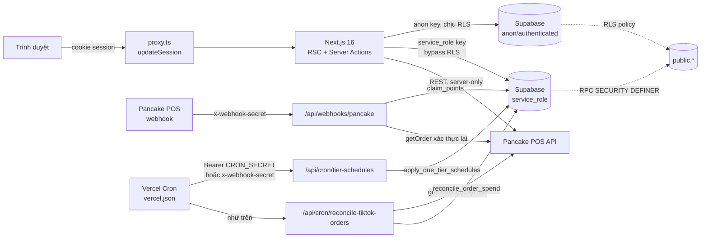
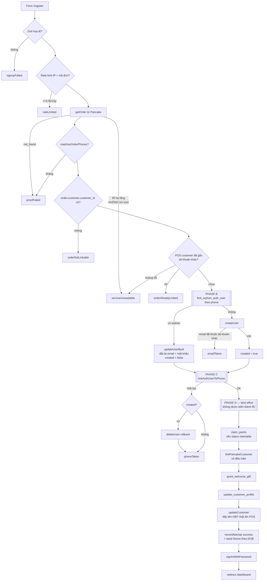
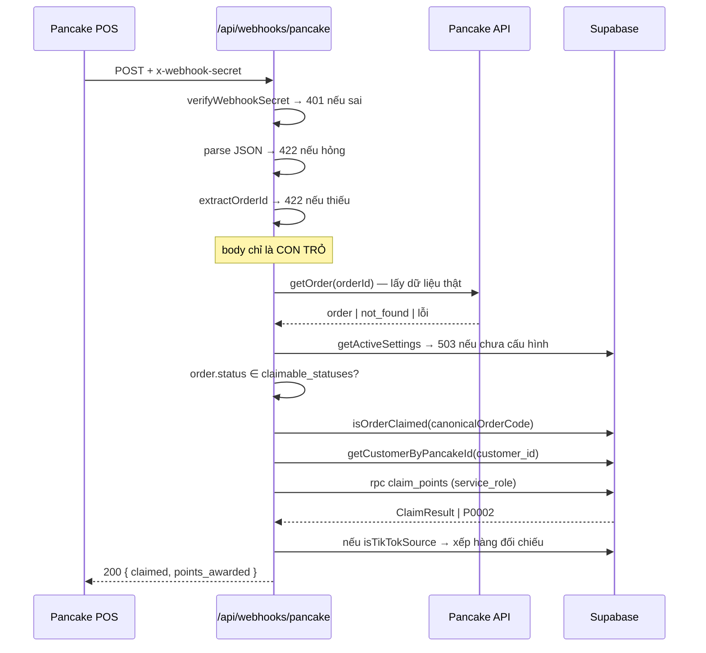
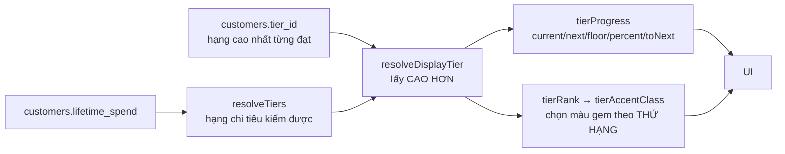
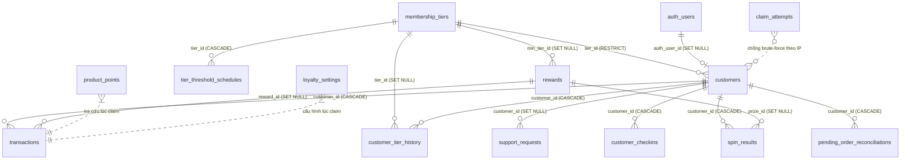

# Tổng quan hệ thống — Chicha Pet Members

> **Tài liệu này mô tả hiện trạng code, không phải spec.** Khi tài liệu lệch với code,
> code là đúng. Mọi tham chiếu ghi dạng `đường/dẫn:dòng` để mở thẳng trong editor.
>
> Đối tượng đọc: người review lại toàn bộ nghiệp vụ mà không phải mở từng file.
> Bản đồ ngắn gọn cho AI agent nằm ở `AGENTS.md`; hướng dẫn cài đặt/chạy nằm ở `README.md`.

---

## Mục lục

| #   | Mục                                                                   | Nội dung                                       |
| --- | --------------------------------------------------------------------- | ---------------------------------------------- |
| 0   | [Hệ thống này làm gì](#0-hệ-thống-này-làm-gì)                         | Tóm tắt nghiệp vụ, stack, biến môi trường      |
| 1   | [Bản đồ hệ thống](#1-bản-đồ-hệ-thống)                                 | Sơ đồ kiến trúc, 3 Supabase client             |
| 2   | [Bốn nguyên tắc bất biến](#2-bốn-nguyên-tắc-bất-biến)                 | Đọc trước khi sửa bất cứ gì                    |
| 3   | [Xác thực & phân quyền](#3-xác-thực--phân-quyền)                      | Phone → email thật, JWT claim, 5 luật redirect |
| 4   | [Flow đăng ký](#4-flow-đăng-ký-signup)                                | Flow phức tạp nhất — 4 phase                   |
| 5   | [Cổng sở hữu số điện thoại](#5-cổng-sở-hữu-số-điện-thoại)             | Chống mạo danh trên dữ liệu masked             |
| 6   | [Flow cộng điểm hằng ngày](#6-flow-cộng-điểm-hằng-ngày-webhook)       | Webhook Pancake + đối chiếu TikTok             |
| 7   | [Tính điểm](#7-tính-điểm)                                             | Công thức ở SQL + quà chào mừng, điểm danh, vòng xoay |
| 8   | [Hệ thống hạng](#8-hệ-thống-hạng)                                     | Spend-based, sticky, grandfathering            |
| 9   | [Đổi quà](#9-đổi-quà)                                                 | `redeem_reward` (bản `0022`) + cổng hạng       |
| 10  | [Điều chỉnh thủ công](#10-điều-chỉnh-thủ-công-admin)                  | `adjust_points`                                |
| 11  | [Schema database](#11-schema-database)                                | 15 bảng, RLS, index, errcode                   |
| 12  | [Changelog 22 migration](#12-changelog-22-migration)                  | Mỗi migration thêm gì, vì sao                  |
| 13  | [Inventory route & Server Action](#13-inventory-route--server-action) | Toàn bộ bề mặt ứng dụng                        |
| 14  | [i18n & Theme](#14-i18n--theme)                                       | Hai stack cookie song song                     |
| 15  | [Design system](#15-design-system)                                    | Token, thang chữ, cạm bẫy build                |
| 16  | [Test](#16-test)                                                      | Phủ cái gì, thiếu cái gì                       |
| 17  | [Sổ nợ kỹ thuật](#17-sổ-nợ-kỹ-thuật)                                  | **Mục quan trọng nhất khi review**             |

---

## 0. Hệ thống này làm gì

Ứng dụng tích điểm khách hàng thân thiết cho một shop thú cưng bán qua **Pancake POS**.

1. Khách mua hàng tại Pancake POS như bình thường — ứng dụng không can thiệp vào việc bán.
2. Khách đăng ký tài khoản một lần tại `/register`, dùng **một mã đơn gần đây làm bằng
   chứng sở hữu số điện thoại**. Không có màn hình "nhập mã đơn để tích điểm" thủ công.
3. Từ đó về sau, **mọi đơn được cộng điểm tự động** qua webhook Pancake bắn về
   `/api/webhooks/pancake`.
4. Điểm là **tiền tệ** — chỉ dùng để đổi quà tại `/rewards`.
5. Hạng thành viên tính theo **chi tiêu tích luỹ (đồng)**, hoàn toàn tách khỏi điểm.

### Stack

| Thành phần      | Version                                       | Ghi chú                                                                |
| --------------- | --------------------------------------------- | ---------------------------------------------------------------------- |
| Next.js         | 16.2.10                                       | App Router. **`middleware` đã đổi tên thành `proxy`** → `src/proxy.ts` |
| React           | 19.2.4                                        | React Compiler bật — dùng `useWatch`, không dùng `form.watch()`        |
| Supabase        | `@supabase/ssr` 0.12.3, `supabase-js` 2.110.7 | Postgres + Auth + RLS                                                  |
| shadcn/ui       | trên **Base UI** 1.6                          | **KHÔNG phải Radix** → Button không có `asChild`                       |
| Tailwind CSS    | v4                                            | Cấu hình bằng CSS (`@theme inline`), không có `tailwind.config`        |
| Zod             | v4                                            | Schema build theo request để lấy thông điệp lỗi đúng ngôn ngữ          |
| react-hook-form | 7.82                                          | + `@hookform/resolvers`                                                |
| Vitest          | 4.1                                           | Hai project: node (unit) + jsdom (component)                           |

Script: `npm run dev | build | lint | typecheck | test | test:watch | test:coverage`.

### Biến môi trường (`.env.example`)

| Biến                                   | Client thấy được?  | Dùng ở đâu                                           |
| -------------------------------------- | ------------------ | ---------------------------------------------------- |
| `NEXT_PUBLIC_SUPABASE_URL`             | ✅                 | Cả 3 Supabase client                                 |
| `NEXT_PUBLIC_SUPABASE_PUBLISHABLE_KEY` | ✅                 | `client.ts`, `server.ts`, `middleware.ts` — chịu RLS |
| `SUPABASE_SERVICE_ROLE_KEY`            | ❌ **server-only** | `admin.ts` — bypass RLS, gọi mọi RPC                 |
| `PANCAKE_API_KEY`                      | ❌ **server-only** | `src/lib/pancake/client.ts`                          |
| `PANCAKE_SHOP_ID`                      | ❌                 | như trên                                             |
| `PANCAKE_API_URL`                      | ❌                 | tuỳ chọn, mặc định `https://pos.pages.fm/api/v1`     |
| `WEBHOOK_SECRET`                       | ❌                 | header `x-webhook-secret` — webhook Pancake **và** cả hai cron |
| `CRON_SECRET`                          | ❌                 | Vercel Cron gửi `Authorization: Bearer` — chỉ hai route cron nhận (`webhook-auth.ts:24-29`) |

---

## 1. Bản đồ hệ thống



### Ba Supabase client — chọn sai là lỗ hổng

| File                         | Key                | RLS           | Dùng ở đâu                                                                                                                                                   |
| ---------------------------- | ------------------ | ------------- | ------------------------------------------------------------------------------------------------------------------------------------------------------------ |
| `src/lib/supabase/client.ts` | publishable (anon) | ✅ chịu       | Client Component trong trình duyệt                                                                                                                           |
| `src/lib/supabase/server.ts` | publishable (anon) | ✅ chịu       | RSC, Server Action, Route Handler. Cookie qua `next/headers`. `setAll` bọc try/catch vì gọi từ Server Component sẽ throw — middleware lo việc refresh cookie |
| `src/lib/supabase/admin.ts`  | **service_role**   | ❌ **bypass** | `import "server-only"` chặn lọt vào bundle client. **Đây là client duy nhất gọi được mọi RPC** (trừ `is_admin()`)                                            |

### Nguyên tắc xuyên suốt

**Đơn hàng không bao giờ được lưu vào database.** Chúng sống trong Pancake POS và được
fetch live mỗi lần cần (`cache: "no-store"`). Migration `0001_schema.sql:10-14` xoá hẳn
bảng `orders` của phiên bản trước. Thứ duy nhất được lưu là `transactions.order_code` —
một chuỗi định danh, dùng làm khoá chống trùng.

---

## 2. Bốn nguyên tắc bất biến

Đọc kỹ bốn điều này trước khi sửa bất cứ gì liên quan tới điểm hoặc hạng.

### ① `claim_points` là đường ghi duy nhất cho một lần cộng điểm TỪ ĐƠN HÀNG

Không có đường nào khác **cho đơn hàng**. Không được `update customers set current_points = ...`
từ code ứng dụng. RPC nằm ở `supabase/migrations/0011_claim_spend.sql`, chỉ cấp cho
`service_role` (vì nó **tin tưởng danh sách item được đưa vào** — không tự xác thực đơn hàng).

Từ `0018`–`0022` có thêm **ba đường ghi ledger không đi qua đơn hàng**, mỗi đường mang chốt
chống trùng riêng của nó — đó mới là thứ phải soi khi thêm đường thứ tư:

| RPC                  | Migration | `source`    | Chốt chống trùng                                                     |
| -------------------- | --------- | ----------- | -------------------------------------------------------------------- |
| `grant_welcome_gift` | `0018`    | `'welcome'` | partial unique index `transactions_welcome_once_idx (customer_id)`   |
| `checkin`            | `0019`    | `'checkin'` | unique index `customer_checkins_once_per_day_idx` theo ngày giờ VN   |
| `spin_wheel`         | `0022`    | `'spin'`    | `count(*)` trên `spin_results` + khoá dòng `customers` (không index) |

Cả ba **chỉ chạm điểm**, không bao giờ chạm `lifetime_spend` hay `tier_id`.

Chống cộng trùng dựa **hoàn toàn** vào partial unique index:

```sql
create unique index transactions_order_code_uniq
  on public.transactions (order_code) where order_code is not null;
```

RPC bắt `unique_violation` và ném lại `P0002 'order already claimed'`. Cả flow đăng ký
lẫn webhook đều đâm vào cùng một cái khoá này — đó là lý do một đơn không bao giờ được
cộng hai lần dù hai đường chạy song song.

### ② Hạng theo CHI TIÊU, điểm là TIỀN TỆ

| Cột                         | Đơn vị                 | Quyết định cái gì                                        |
| --------------------------- | ---------------------- | -------------------------------------------------------- |
| `customers.lifetime_spend`  | đồng (`numeric(14,0)`) | **Hạng** — so với `membership_tiers.spend_threshold`     |
| `customers.lifetime_points` | điểm                   | **Không quyết định gì cả** ngoài việc là con số hiển thị |
| `customers.current_points`  | điểm                   | Số dư khả dụng để đổi quà                                |

Trước migration `0010` thì hạng tính theo `lifetime_points`. Đừng đọc code cũ theo mô hình đó.

### ③ `customers.tier_id` = hạng cao nhất TỪNG đạt — sticky, chỉ tăng

Không có cơ chế tụt hạng nào trong toàn hệ thống.

- Chỉ **ba** nơi được nâng: `claim_points` (`0011`), `adjust_points` (`0012`) và
  `reconcile_order_spend` (`0016:117-129` — đối chiếu lại tiền đơn TikTok, xem [§6](#6-flow-cộng-điểm-hằng-ngày-webhook)).
- Cả ba đều so bằng **`spend_threshold`**, không phải `sort_order` (vì `sort_order` là số
  nguyên tự do admin gõ được), và đều chỉ nhận khi ngưỡng mới **lớn hơn hẳn** ngưỡng đang giữ.
- Ngưỡng chỉ được nâng qua `tier_threshold_schedules`, áp bởi `apply_due_tier_schedules()`.
- **`apply_due_tier_schedules()` không hề đụng tới bảng `customers`. Chính sự bỏ sót đó
  LÀ cơ chế grandfathering** — nâng ngưỡng lên không đá ai xuống hạng.

### ④ Khách không có đường ghi trực tiếp vào `public.customers`

Không có RLS policy `INSERT` nào trên bất kỳ bảng nào trong toàn schema. Mọi thay đổi số
dư đều đi qua RPC `SECURITY DEFINER` chỉ cấp cho `service_role`:

| RPC                       | Được phép chạm                                        | Không được chạm                                |
| ------------------------- | ----------------------------------------------------- | ---------------------------------------------- |
| `claim_points`            | điểm, spend, tier                                     | —                                              |
| `redeem_reward`           | `current_points`, tồn kho quà                         | `lifetime_points`, `lifetime_spend`, `tier_id` |
| `update_customer_profile` | tên, DOB, thông tin thú cưng                          | **mọi cột điểm/spend/tier**                    |
| `adjust_points`           | điểm, tier                                            | **`lifetime_spend`**                           |
| `grant_welcome_gift`      | điểm                                                  | spend, tier                                    |
| `checkin`                 | điểm                                                  | spend, tier                                    |
| `spin_wheel`              | điểm, tồn kho slice `gift`                            | spend, tier                                    |
| `reconcile_order_spend`   | `lifetime_spend`, tier, `meta` của dòng EARN **cũ**   | **không tạo dòng ledger mới**, không đụng điểm |

---

## 3. Xác thực & phân quyền

### Danh tính khách = số điện thoại, credential = email thật

Supabase Auth chỉ hỗ trợ mật khẩu gắn với **email**. Vì vậy `/register` **bắt buộc** nhập
email thật; địa chỉ đó được ghi vào **cả** `auth.users.email` **lẫn** `customers.email`
(một nguồn ghi duy nhất là `signUp`, hai chỗ không được phép lệch nhau).

Form đăng nhập vẫn chỉ có ô số điện thoại: `signIn` tra `customers.email` theo phone rồi mới
gọi `signInWithPassword`. Số điện thoại là **khoá tra cứu**, không phải credential.

```
signIn("0901234567", pw)  →  customers.email  →  signInWithPassword(email, pw)
```

Trước `0014` địa chỉ này là alias tổng hợp `phoneToEmail(phone)` →
`0901234567@customer.chicha-label.app`; hàm đó đã bị xoá.

Không có thư nào được gửi đi — không xác nhận email, không quên mật khẩu. Tài khoản vẫn
được tạo bằng **admin API** `admin.auth.admin.createUser({ email_confirm: true })` để không
có mail xác nhận nào bị xếp hàng, bất kể cấu hình email của project.

### Admin vs khách = một claim JWT duy nhất

```
app_metadata.role === "admin"
```

`app_metadata` **chỉ ghi được bằng service-role key** → khách không thể tự phong mình.
`user_metadata` thì khách sửa được, nên không bao giờ dùng để phân quyền.

Cùng một claim được đọc ở hai tầng:

| Tầng             | Nơi đọc                                                                           |
| ---------------- | --------------------------------------------------------------------------------- |
| Edge (redirect)  | `src/lib/supabase/middleware.ts:47` — `user?.app_metadata?.role === "admin"`      |
| SQL (RLS policy) | `public.is_admin()` — `supabase/migrations/0005_roles_and_customer_rls.sql:20-34` |

`is_admin()` là **hàm duy nhất trong schema được cấp cho `anon`/`authenticated`**, vì các
RLS policy phải gọi được nó. Nó `SECURITY DEFINER` + `set search_path = public` để khách
không thể tạo hàm cùng tên che nó.

Quá trình đăng ký khách **không hề set `app_metadata`** → khách không bao giờ mang role admin.

### Năm luật redirect — đúng thứ tự

`src/lib/supabase/middleware.ts:56-65`. Session được đọc bằng `supabase.auth.getUser()` —
một lần gọi mạng thật, không phải decode cookie.

| #   | Điều kiện                                             | Hành động                                    | Dòng  |
| --- | ----------------------------------------------------- | -------------------------------------------- | ----- |
| 1   | ở `/admin` (trừ `/admin/login`) và **chưa** đăng nhập | → `/admin/login`                             | `:57` |
| 2   | ở `/admin`, **có** session, **không** phải staff      | → `/dashboard`                               | `:59` |
| 3   | ở `/admin/login` và **là** staff                      | → `/admin`                                   | `:61` |
| 4   | ở route tài khoản và chưa đăng nhập                   | → `/login`                                   | `:64` |
| 5   | ở `/login`/`/register` mà đã có session               | → `/admin` nếu staff, ngược lại `/dashboard` | `:65` |

Hệ quả của thứ tự:

- Luật 2 **không có** điều kiện loại trừ `/admin/login`, và nó chạy trước luật 3 → **một
  khách đang đăng nhập vào `/admin/login` sẽ bị đá về `/dashboard`**, không thấy form
  đăng nhập staff. Muốn dùng form đó phải đăng xuất trước.
- Khách vãng lai vào `/admin/login`: qua luật 1 (bị loại trừ) và luật 3 (`isStaff` false)
  → trang hiển thị bình thường.
- Chỉ `/admin` mới đòi role. `/dashboard`, `/rewards`, `/history` chỉ đòi **có session** —
  staff cũng xem được portal khách.
- Helper redirect xoá sạch query string (`url.search = ""`, `:52`) → **không có cơ chế
  `?next=` quay lại trang cũ**.

`src/proxy.ts` chạy trên **mọi** đường dẫn trừ `_next/static`, `_next/image`, `favicon.ico`
và file ảnh — bao gồm cả `/api/*`.

### ⚠️ Lỗ hổng phòng thủ tầng edge

```ts
// src/lib/supabase/middleware.ts:9
const ACCOUNT_PREFIXES = ["/dashboard", "/rewards", "/history"]
```

Comment ngay trên nói list này "kept in sync with the route group
`src/app/(customer)/(account)/`" — **nhưng route group đó có BẢY segment**: `dashboard`,
`help`, `history`, `profile`, `rewards`, `spin`, `tiers`.

`/tiers`, `/help`, `/profile` và `/spin` **không** được middleware chặn. Chúng vẫn an toàn nhờ
tầng dưới: `(account)/layout.tsx` gọi `getAccount()`, và `account.ts:28` tự `redirect("/login")`
khi không có session. Nhưng điểm thực thi khác nhau tuỳ route (edge cho 3 route, RSC cho 4
route còn lại), và comment trong file đang nói sai. Mỗi tính năng mới thêm vào `(account)/`
lại nới khoảng lệch này ra — `/spin` là cái gần nhất.

### Server Action tự kiểm tra lại

Middleware không phải cổng duy nhất. **Bất kỳ Server Action nào chạm `createAdminClient()`
đều tự verify lại claim admin**, không tin route:

- `src/app/admin/tiers/actions.ts:112-118` — helper `requireAdmin()`, gọi ở `:133`, `:179`,
  `:209`, `:232`
- `src/app/admin/customers/[id]/actions.ts:33`

Các action ở lại trên RLS client dựa vào policy: `saveTier` (`tiers/actions.ts:29`), toàn bộ
`admin/rewards/actions.ts` (`saveReward :28`, `deleteReward :104`, `saveSpinPrize :137`,
`deleteSpinPrize :217`), `admin/blog/actions.ts`, `admin/spin/actions.ts`,
`admin/products/actions.ts`, `admin/settings/actions.ts`, `admin/support/actions.ts`.
`setSupportStatus` còn coi `count === 0` là thất bại, vì RLS từ chối bằng cách khớp 0 dòng chứ
không báo lỗi (`admin/support/actions.ts:26-31`).

**Phía khách thì ngược lại — và có chủ ý.** `checkIn`, `spin`, `redeemReward`, `saveProfile`,
`submitSupportRequest` đều cầm `createAdminClient()` sau khi **chỉ kiểm danh tính**
(`auth.getUser()`), không kiểm vai trò. Được, vì thứ chúng gọi là RPC chỉ ghi vào đúng dòng
của người gọi: client chỉ gửi được `rewardId`, còn `customer_id` luôn do server giải ra từ
session — xem [§9](#9-đổi-quà).

### Webhook & cron — không dùng session

`src/lib/webhook-auth.ts`:

| Hàm                      | Dòng | Ai dùng                                                                        |
| ------------------------ | ---- | ------------------------------------------------------------------------------ |
| `verifyWebhookSecret`    | `:12` | Webhook Pancake — **chỉ** header `x-webhook-secret`                            |
| `verifyCronRequest`      | `:24` | Cả hai route cron — nhận header đó **hoặc** `Authorization: Bearer $CRON_SECRET` (`:27-29`) |
| `timingSafeHeaderEqual`  | `:32` | Nền chung của cả hai                                                           |

- So bằng `timingSafeEqual`; short-circuit khi độ dài lệch (vì `timingSafeEqual` throw nếu hai
  buffer khác độ dài).
- **Fail-closed**: env tương ứng chưa set → từ chối tất cả (`:37`).
- Pancake **không ký webhook** — chỉ hỗ trợ header tĩnh, nên đây là mức bảo vệ khả dĩ nhất.

Nhánh Bearer tồn tại vì **Vercel Cron không set được header tuỳ ý**: nó chỉ gửi
`Authorization: Bearer $CRON_SECRET`. `vercel.json` khai báo hai lịch — `/api/cron/tier-schedules`
lúc 01:00 và `/api/cron/reconcile-tiktok-orders` lúc 02:00 (UTC) mỗi ngày.

### Throttle đăng nhập admin (`0021`)

`/admin/login` là cửa quyền cao nhất hệ thống và tới trước `0021` **không có throttle nào**.
Nó dùng bộ đếm riêng, không dùng chung `claim_attempts` (bảng kia gắn với order code):
`isLoginRateLimited` (`rate-limit.ts:96`), `recordLoginAttempt` (`:109`),
`MAX_LOGIN_FAILURES_PER_IP = 5` (`:92`) — chỉ `admin/login/actions.ts:28,33` gọi. Đăng nhập
khách vẫn đi qua `isRateLimited`/`claim_attempts`.

---

## 4. Flow đăng ký (`signUp`)

Đây là flow phức tạp nhất trong hệ thống, vì nó vừa là đăng ký, vừa là **bước liên kết**
tài khoản với Pancake POS, vừa là lần tích điểm đầu tiên. Toàn bộ ở
`src/app/(customer)/auth/actions.ts:115-371`.

Form `/register` bắt buộc **toàn bộ** trường: họ tên, email, ngày sinh, số điện thoại, mật
khẩu (≥ 8 ký tự), mã đơn gần đây, checkbox điều khoản (`register-form.tsx`).



### Phase A — mọi thứ có thể từ chối, làm TRƯỚC khi tạo auth user

Nguyên tắc: nếu có thể từ chối thì phải từ chối **trước** khi có auth user, để không sinh rác.

| Bước             | Dòng       | Chi tiết                                                                                                                                                                                                                             |
| ---------------- | ---------- | ------------------------------------------------------------------------------------------------------------------------------------------------------------------------------------------------------------------------------------ |
| 1. Zod           | `:122`     | `makeCustomerSignupSchema` (fail `:131-133`). Checkbox `terms` nhận cả `"on"` (native checkbox post) lẫn `"true"`                                                                                                                    |
| 2. Rate limit    | `:140-141` | `isRateLimited(ip, typedCode)` — **hai ngân sách**: theo IP _và_ theo mã đơn. (`signIn` `:81` thì chỉ theo IP)                                                                                                                       |
| 3. Fetch đơn     | `:150`     | `getOrder(typedCode)`. **Chỉ `not_found` mới là `proofFailed`** (`:160`); lỗi hạ tầng (`unauthorized`/`unavailable`/`malformed`) trả `serviceUnavailable` `:155-158` và **KHÔNG trừ lượt** — `recordAttempt` `:159` chỉ chạy cho `not_found` |
| 4. Cổng sở hữu   | `:166`     | `matchesOrderPhones(phone, orderPhoneCandidates(order))` → xem [mục 5](#5-cổng-sở-hữu-số-điện-thoại). Thất bại trả `proofFailed` `:168` — **cùng thông điệp với mã đơn sai, để không rò rỉ việc shop có biết số này hay không**      |
| 5. Bắt buộc link | `:173-177` | `order.customer?.customer_id` thiếu → `orderNotLinkable`. Không có id này thì webhook về sau không bao giờ quy được đơn cho ai                                                                                                       |
| 6. Chống cướp    | `:188`     | `getCustomerByPancakeId()` — POS customer đã thuộc số khác → `orderAlreadyLinked` `:193-196`. Từ chối to tiếng còn hơn để `linkPancakeCustomer` (fill-if-NULL) im lặng bỏ qua và để tài khoản không bao giờ liên kết được            |
|                  | `:189-192` | Lookup **lỗi** thì dừng bằng `serviceUnavailable`, cũng không trừ lượt — không fail-open thành "chưa ai giữ"                                                                                                                        |
| 7. Chốt mã       | `:198`     | `canonicalOrderCode(order)` — luôn lấy `order.id`, không lấy mã người dùng gõ. Chặn việc một đơn bị claim hai lần qua `id` và `system_id`. Vẫn nằm ở Phase A, ngay trước `createAdminClient()` `:201`                                |

### Phase B — tạo auth user

**Hỏi orphan TRƯỚC khi tạo gì cả**, và tra theo **số điện thoại** chứ không theo email
(`0014`): người đăng ký lại rất có thể đang sửa email gõ sai lần trước, còn số điện thoại
mới là thứ vừa được mã đơn chứng minh.

```sql
-- 0014_real_email_identity.sql (thay bản 0009 tra theo email) — gọi ở :211-214
find_orphan_auth_user(p_phone) -- trả về uuid hoặc null
```

Trả về id **chỉ khi** cả ba điều kiện đúng:

1. `raw_user_meta_data->>'phone'` khớp — đúng số này, do `createUser` ghi vào lúc đăng ký.
2. **Không có dòng `customers` nào trỏ tới nó** — một tài khoản thật luôn có, vì
   `linkAuthUserToPhone` chạy ngay sau `createUser` và rollback nếu hỏng. Đây là toàn bộ
   lập luận an toàn: một auth user không có dòng `customers` chỉ có thể là xác của lần
   đăng ký hỏng.
3. `raw_app_meta_data->>'role' <> 'admin'` — để không bao giờ trả về id của staff (staff
   cũng không có dòng `customers`).

- Có orphan → `updateUserById({ email, password, email_confirm: true, user_metadata })` `:222`
  (fail `:231-239`), `created = false`, **để rollback không bao giờ xoá tài khoản đã nhận nuôi**.
- Không có → `admin.auth.admin.createUser({ email, password, email_confirm: true,
user_metadata: { phone } })` `:250` (fail `:260-270`). Lỗi `email_exists` / `"already"` ở đây **không còn** nghĩa
  là "số điện thoại đã đăng ký" — nếu số này có auth user thì bước trên đã nhận nuôi rồi —
  mà nghĩa là **email thuộc về người khác** → `emailTaken`. Trùng số điện thoại do
  `linkAuthUserToPhone` bắt ở Phase C, vì `customers.phone` mới là cột unique.

### Phase C — liên kết

`linkAuthUserToPhone(authUserId, phone, email)` `:275` — upsert `customers` trên `phone`
(`loyalty.ts:289`). Đây là chỗ điểm mà webhook đã cộng cho số điện thoại này từ trước được
**kế thừa** sang tài khoản mới.

Email được ghi ở đây chứ không giao cho `claim_points`: RPC đó bị bỏ qua hẳn khi đơn chưa
settled, và upsert của nó chỉ điền vào chỗ NULL. Một dòng `customers` có email lệch với
`auth.users.email` thì **không đăng nhập được**, nên bước ghi này phải nằm trên nhánh vô
điều kiện.

Thất bại (`:276-280`) → rollback `admin.auth.admin.deleteUser()` `:278` **chỉ khi
`created === true`**, trả `phoneTaken`.

### Phase D — best-effort, không được biến signup thành lỗi (`:284-371`)

Mọi thứ dưới đây chỉ được `console.warn`, không được trả về lỗi — **trừ `linkPancakeCustomer`**.

| Bước                     | Dòng       | Chi tiết                                                                                                                                                                                                                              |
| ------------------------ | ---------- | ------------------------------------------------------------------------------------------------------------------------------------------------------------------------------------------------------------------------------------- |
| Tích điểm đơn bằng chứng | `:288-300` | **Cổng trạng thái nằm ở ĐÂY, không nằm trong RPC**: `getActiveSettings()` `:288` rồi `settings?.claimable_statuses.includes(order.status)` `:289`. Nếu đơn chưa giao xong thì bỏ qua, điểm sẽ về sau qua webhook. Gọi `claim_points` `:290` với `p_source: "claim"`, `p_email: null` (warn `:302-304`) |
| Liên kết POS             | `:313`     | `linkPancakeCustomer()` — **vô điều kiện, và là bước best-effort duy nhất được phép kết thúc signup**: thất bại `:314-323` trả `serviceUnavailable` hoặc `orderAlreadyLinked`. Không có link thì tài khoản vô hình với webhook mãi mãi |
| **Quà chào mừng**        | `:328-330` | `grant_welcome_gift` (`0018`) — gọi vô điều kiện; RPC tự im lặng khi tính năng tắt hoặc đã cấp. Xem [§7](#7-tính-điểm)                                                                                                                |
| Ghi hồ sơ                | `:335-342` | `update_customer_profile` — họ tên + ngày sinh                                                                                                                                                                                        |
| Đẩy ngược lên POS        | `:347-355` | `updateCustomer(pancakeCustomerId, { name, phone })` `:348` — ghi tên và số thật lên Pancake, chỉ điền chỗ POS đang thiếu                                                                                                             |
| Ghi nhận thành công      | `:357`     | `recordAttempt(ip, orderCode, true)`                                                                                                                                                                                                  |
| Seed theme               | `:361`     | `setThemeCookie(themeForDob(dob))` — tài khoản mới, chưa có lựa chọn nào                                                                                                                                                              |
| Đăng nhập                | `:365`     | `createUser` không phát session nên phải `signInWithPassword` lần nữa (fail `:369` → `signInFailed`)                                                                                                                                  |
|                          | `:371`     | `redirect("/dashboard")`                                                                                                                                                                                                              |

### Bảng thông điệp lỗi

| Key                  | Nguyên nhân thật                                                                                            |
| -------------------- | ----------------------------------------------------------------------------------------------------------- |
| `signupFailed`       | Zod fail, hoặc `createUser` lỗi không phải "đã tồn tại", hoặc nhận nuôi orphan lỗi                          |
| `rateLimited`        | ≥ 5 lần thất bại trong 15 phút từ cùng IP **hoặc** cùng mã đơn                                             |
| `proofFailed`        | Mã đơn không tồn tại **hoặc** số điện thoại không khớp đơn — gộp có chủ ý                                  |
| `serviceUnavailable` | Pancake down / API key hỏng / lookup DB lỗi — **tách khỏi `proofFailed`, và không trừ lượt rate limit**     |
| `orderNotLinkable`   | Đơn không có `customer.customer_id`                                                                         |
| `orderAlreadyLinked` | POS customer của đơn đã thuộc tài khoản khác (hoặc `linkPancakeCustomer` phát hiện xung đột ở Phase D)      |
| `phoneTaken`         | `linkAuthUserToPhone` thất bại — dòng `customers` của số này đã thuộc auth user khác                        |
| `emailTaken`         | Email vừa nhập đã thuộc về một tài khoản khác (`email_exists` từ Supabase)                                  |
| `signInFailed`       | Tài khoản đã tạo và liên kết xong, nhưng lần đăng nhập cuối hỏng                                            |

### Đăng nhập (`signIn`, `:63-112`)

Zod `:70` → rate limit **chỉ theo IP** `:80-81` → `getCustomerByPhone(phone)` `:87` lấy
`customers.email` → `signInWithPassword(email, password)` `:94`. Số chưa đăng ký (không có
dòng, hoặc dòng chưa có email) đi qua **đúng** rate limiter (`recordAttempt(ip, null, false)`
`:89` và `:101`) và trả về **đúng** một thông điệp `invalidCredentials` như khi sai mật khẩu —
**không bao giờ phân biệt số chưa đăng ký với sai mật khẩu**.

Có một bước phụ: nếu đăng nhập thành công **và** cookie theme đang `null` (chưa quyết),
seed theme theo ngày sinh (`:107-110`). Người đã tự bấm đổi theme thì giữ nguyên lựa chọn.
`redirect("/dashboard")` `:112`.

**Không có luồng quên mật khẩu.** Link "Quên mật khẩu" ở `login-form.tsx` chỉ là một Tooltip.

---

## 5. Cổng sở hữu số điện thoại

`src/lib/phone.ts`. Đây là thứ ngăn người lạ nhặt được mã đơn của người khác rồi đăng ký
tài khoản trên đơn đó.

### Vấn đề: Pancake che dữ liệu

API Pancake trả về dữ liệu khách hàng **đã bị che** ở mọi endpoint:

```
phone:  "0****70"     ← chỉ thấy chữ số đầu + hai chữ số cuối, độ dài bị giấu
name:   "K******h"
```

Không thứ gì đọc được từ một bản ghi khách hàng Pancake được phép coi là tên thật hay số
thật.

### Cách gom ứng viên

```ts
orderPhoneCandidates(order) // client.ts:308
// = [ bill_phone_number,
//     ...customer.phone_numbers,
//     shipping_address.phone_number ]  (lọc bỏ rỗng)
```

Cố tình **không** dừng ở giá trị đầu tiên tìm thấy. Bug cũ chính là chuyện đó: cổng chấp
nhận `bill_phone_number` (luôn bị che) trong khi một số thật đang nằm cách đó hai trường.

### Cách đối chiếu

`matchesOrderPhones(input, candidates)` (`phone.ts:89`):

```
1. normalizePhone(input); rỗng → false
2. known = ứng viên không rỗng
3. real  = known.filter(không bị che)
4. NẾU có bất kỳ số thật nào:
       → CHỈ so khớp TUYỆT ĐỐI, bỏ qua toàn bộ mask nằm cạnh
   NGƯỢC LẠI:
       → fallback: known.some(mask => matchesMask(phone, mask))
```

`matchesMask` (`:45`) so **tiền tố + hậu tố**, và từ chối input ngắn hơn tổng phần hiện
(nên `"094"` không thoả `"0****94"`).

`isMasked` (`:39`) **fail-closed** — rỗng hoặc null cũng tính là bị che.

### Vòng khép kín

Mask đơn thuần lọt khoảng **1 trên 10 000** số Việt Nam ngẫu nhiên. Nhưng đăng ký thành
công sẽ gọi `updateCustomer` ghi số thật lên POS → bản ghi đó **vĩnh viễn** chuyển sang
đường so khớp tuyệt đối. Test pin hành vi này:
`phone.test.ts` — _"stops a mask-compatible impostor once the real number is known"_.

### `normalizePhone` (`:12`)

`+84…` → `0` + phần còn lại; `84…` dài ≥ 10 → `0` + phần còn lại; ngược lại chỉ bỏ dấu `+`
ở đầu. Chỉ giữ chữ số và `+`.

---

## 6. Flow cộng điểm hằng ngày (webhook)

`src/app/api/webhooks/pancake/route.ts:63-185`. Đây là **cách duy nhất** điểm từ ĐƠN HÀNG được
cộng sau khi đăng ký. Nó không bao giờ tạo được khách mới — không có số điện thoại thật nào để
làm khoá.



### Ba quyết định thiết kế quan trọng

**(a) Body webhook chỉ là con trỏ.** `extractOrderId(body)` `:49-56` (schema `:36-47`) chỉ rút
ra một định danh; handler luôn `getOrder()` `:85` lại từ Pancake để lấy dữ liệu thật. Một
payload giả mạo không mua được gì cả — kẻ tấn công chỉ có thể khiến hệ thống fetch lại một đơn
có thật.

**(b) Mã trạng thái HTTP theo ngữ nghĩa retry.** Pancake retry mọi phản hồi non-2xx, nên:

| Tình huống                                                         | HTTP    | Mã                                        | Vì sao                                    |
| ------------------------------------------------------------------ | ------- | ----------------------------------------- | ----------------------------------------- |
| Sai secret (`:64-65`)                                              | 401     | `unauthorized`                            | Retry vô ích                              |
| JSON hỏng (`:69-73`) / thiếu order id (`:76-78`)                   | 422     | `invalid_json` · `missing_order_id`       | Retry vô ích                              |
| **Mọi kết quả nghiệp vụ** (không đủ điều kiện, đã claim, khách lạ) | **200** | `skipped: …`                              | Không phải lỗi — retry chỉ tốn tài nguyên |
| Pancake down (`:105-107`)                                          | 503     | `pancake_unavailable`                     | **Nên** retry                             |
| Chưa cấu hình settings (`:113`)                                    | 503     | `not_configured`                          | **Nên** retry                             |
| Lookup DB lỗi (`:135-138`)                                         | 503     | `db_unavailable`                          | **Nên** retry — không hạ thành "khách lạ" |
| RPC lỗi lạ (`:164`)                                                | 500     | `claim_failed`                            | **Nên** retry                             |

**(c) Dữ liệu định danh lấy từ DB local.** `p_phone`, `p_full_name`, `p_email` truyền vào
RPC (`:146-157`) đều lấy từ dòng `customers` trong database, **không bao giờ** lấy từ payload
Pancake đã bị che.

### Bảng lý do bỏ qua (đều trả 200)

| `skipped`              | Dòng          | Nghĩa                                                                                       |
| ---------------------- | ------------- | ------------------------------------------------------------------------------------------- |
| `order_not_found`      | `:87-89`      | Pancake trả 404 hoặc `success: false`                                                       |
| `pancake_misconfigured` | `:94-104`    | `unauthorized`/`malformed` — **lỗi cấu hình của ta**, retry cũng vô ích nên trả 200 + log CONFIG ERROR |
| `not_eligible`         | `:118-120`    | `order.status` không nằm trong `claimable_statuses`                                         |
| `already_claimed`      | `:131` `:162` | Đã có `transactions` row với `order_code` này, hoặc RPC ném `P0002`                         |
| `unknown_customer`     | `:141-143`    | Đơn không có `customer.customer_id`, hoặc chưa ai đăng ký với id đó                         |

Phản hồi thành công (`:182-185`) **chỉ chứa `{ claimed: true, points_awarded }`** — không kèm
thông tin cá nhân, vì Pancake ghi log toàn bộ body webhook.

### Đối chiếu tiền đơn TikTok (`0016`)

Pancake **sync tổng tiền cuối của TikTok Shop 4–6 ngày sau** khi đơn về, nên `p_order_total`
lúc webhook claim có thể sai. Điểm không bị ảnh hưởng (tính theo SKU), nhưng `lifetime_spend` —
thước đo hạng — thì có.

Sau khi claim xong, `isTikTokSource(order.order_sources_name)` (`client.ts:293`) đúng thì
handler gọi `enqueueTikTokReconciliation` (`:172-179`, helper `:194-226`): insert một dòng
`pending_order_reconciliations` (`:209-217`) với `reconcile_after = now + TIKTOK_RECONCILE_DELAY_DAYS`
(`= 6`, `client.ts:299`).

Cron `/api/cron/reconcile-tiktok-orders` (`POST :18`, `GET :26`, `verifyCronRequest` `:19/:27`)
quét các dòng `status = 'pending'` tới hạn (`:38`), `getOrder` + `orderSpendTotal` đọc lại tiền
(`:66-67`), rồi gọi `reconcile_order_spend` (`:85`).

RPC `0016:53-141`:

1. Khoá dòng EARN `for update` (`:78-80`) rồi khoá `customers` (`:86`).
2. `delta = greatest(p_new_total, 0) - (meta->>'order_total')::numeric`.
3. **UPDATE `meta.order_total` + `reconciled_at` của CHÍNH dòng EARN cũ** (`:96-99`) — không
   thêm dòng ledger nào, nên `transactions_order_code_uniq` không phải nới ra.
4. `lifetime_spend` cộng delta, kẹp `>= 0`.
5. Hạng vẫn **sticky**: chỉ nâng khi `v_new_thr > v_old_thr` (`:117`), và ghi
   `customer_tier_history` với `source = 'webhook'` (`:126-129`).

Errcode: `P0001` — `order_code required` (`:75`), `no earn transaction for order` (`:83`),
`customer not found` (`:88`). Vòng đời `status`: `pending → reconciled | unchanged | failed`;
lỗi tạm thời thì để nguyên `pending` để tick sau thử lại (`route.ts:70`).

### ⚠️ Không có cửa sổ chống replay

Không kiểm tra delivery-id, không kiểm tra timestamp. Tính idempotent dựa **hoàn toàn** vào:

1. Pre-check `isOrderClaimed()` (`:131`) — có race condition,
2. Unique index `transactions_order_code_uniq` → `P0002` (`:162`) — đây mới là cái chốt thật.

Chỉ export `POST`. Không có `GET`/`HEAD`.

---

## 7. Tính điểm

### Công thức

```
base       = Σ ( qty × (points_awarded[sku] ?? unmapped_sku_points) )   -- bỏ qua qty ≤ 0
raw        = base × multiplier
points     = floor | round | ceil (raw)                 -- theo settings.rounding
```

- `points_awarded` tra từ bảng `product_points` **chỉ với dòng `is_active`**. SKU lạ hoặc
  đã tắt đều rơi về `unmapped_sku_points`.
- SKU lấy từ `items[].variation_info.display_id`.
- **`multiplier` lấy từ hạng TRƯỚC đơn này** (`0011:85-95`) — đơn nâng hạng không được
  hưởng multiplier mới ngay trên chính nó.
- Nếu khách chưa có `tier_id`, fallback về hạng cao nhất mà `lifetime_spend` hiện tại
  thoả — để lần claim đầu tiên không báo một lần "nâng hạng" giả.
- `multiplier` không dương → coi như 1.

### Chỉ còn MỘT bản cài

Số học này **chỉ tồn tại trong SQL**: điểm gốc theo SKU `0011:102-107`, làm tròn `:109-113`.

Trước đây có thêm một bản TypeScript độc lập (`calcOrderPoints()` trong `src/lib/points.ts`)
"để preview trên UI admin", và mục này từng coi _nghĩa vụ giữ hai bản đồng bộ_ là rủi ro
hàng đầu. Nhưng **không màn hình admin nào gọi nó** — chỉ test của chính nó gọi. Một bản sao
không ai chạy thì không bắt được lệch; nó chỉ tạo ra đúng cái nghĩa vụ mà nó định gỡ bỏ. Bốn
hàm đó đã bị xoá (`docs/REVIEW.md` #19), `points.ts` giờ chỉ còn type: `Rounding`,
`LoyaltyRules`, `ClaimItem`, `SkuPointMap`.

**Đừng dựng lại bản thứ hai.** Nếu UI admin cần preview thật thì gọi RPC.

> Comment ở `0003:9` và `0004:9` vẫn nhắc nghĩa vụ đồng bộ đó — hai migration ấy đã bị
> `0011` thay thế, giữ nguyên như dấu vết lịch sử. Header của `0011` thì đã cập nhật.

### Chi tiêu

`orderSpendTotal(order)` (`pancake/client.ts:284-287`):

```
total_price_after_sub_discount ?? total_price ?? 0
→ nếu không hữu hạn hoặc ≤ 0 → 0
```

RPC lại kẹp thêm một lần: `v_spend := greatest(coalesce(p_order_total, 0), 0)` (`0011:68`) —
một đơn hoàn tiền hoặc số liệu hỏng **không bao giờ được kéo `lifetime_spend` xuống**.

### Ba đường cộng điểm KHÔNG đi qua đơn hàng

Cả ba đều là RPC `SECURITY DEFINER` chỉ cấp cho `service_role`, chỉ chạm cột điểm, và đều
tắt bằng cách đặt cấu hình tương ứng trong `loyalty_settings` về **0**.

#### Quà chào mừng (`0018`)

`grant_welcome_gift(p_customer_id)` — `0018:24-75`. Số điểm ở
`loyalty_settings.welcome_gift_points` (`0018:12-14`, 0 = tắt).

Một lần mỗi khách, gác bằng **partial unique index** `transactions_welcome_once_idx`
on `(customer_id) where source = 'welcome'` (`0018:21-22`) — chứ không bằng một bảng grants
riêng, để giữ nguyên tư thế "sổ ledger LÀ audit trail".

**RPC không raise gì khi tính năng tắt hoặc đã cấp**: nó trả `{granted:false, points_awarded:0,
current_points}` (`:48-51`, và handler `unique_violation` `:57-60`). Đó là điều kiện để signup
gọi nó **vô điều kiện** ở `auth/actions.ts:328` mà không phải kiểm gì trước.

#### Điểm danh mỗi ngày (`0019`)

`checkin(p_customer_id)` — `0019:49-100`. Ngày lấy theo **múi giờ Việt Nam**:
`(now() at time zone 'Asia/Ho_Chi_Minh')::date`, không phải UTC.

**Insert trước, cộng điểm sau**: unique index `customer_checkins_once_per_day_idx
(customer_id, checkin_date)` (`0019:19-20`) là **toàn bộ** cơ chế chống bấm hai lần, y hệt vai
trò của `transactions_order_code_uniq` với đơn hàng. Vi phạm → `P0002 'already checked in today'`
(`:80`).

Errcode khác: `P0001 'customer not found'` (`:64`), `P0004 'no active loyalty settings'`
(`:69`), `P0005 'checkin disabled'` khi `checkin_points <= 0` (`:73`).

Cửa vào: `(account)/dashboard/actions.ts:33` `checkIn` → rpc `:50`. Hàm đọc:
`loyalty.ts` `getCheckinPoints :90` · `todayInVietnam :103` · `hasCheckedInToday :109`.

#### Vòng xoay may mắn (`0022`)

`spin_wheel(p_customer_id)` — `0022:244-380`. Số lượt/ngày ở
`loyalty_settings.spin_daily_limit` (`0022:27-29`, 0 = tắt).

- **Giải thưởng được rút TRONG RPC.** Trình duyệt chỉ gửi cú click; animation chỉ xoay tới
  đáp án server đã chọn. Khoá dòng `customers` (`:268`) để hai cú click song song không lách
  được quota.
- **Tỉ lệ là `weight`, không phải phần trăm.** Tập hợp lệ = `kind='spin' and is_active and
  weight > 0 and (prize_type <> 'gift' or quantity > 0)`; rút bằng `random() * sum(weight)` so
  với window sum theo thứ tự `(sort_order, id)` (`:308-322`). **Thứ tự này phải khớp thứ tự
  render phía client** — nếu lệch, bánh xe dừng ở ô sai.
- Tối đa **5 vòng thử lại** (`:294`) cho lần trừ tồn có điều kiện `quantity > 0`: thua race
  thì bỏ giải đó và rút lại. Hết đường → `P0004 'no spin prizes configured'` (`:340`).
- **Chỉ `prize_type = 'points'` ghi ledger** (`source='spin'`) và đổi số dư (`:355-368`).
  `'gift'` trả tay tại quầy (admin đánh dấu ở `/admin/spin/winners`); `'none'` không ghi gì
  nhưng vẫn chiếm một ô và một phần weight.
- Errcode: `P0001` `:270` · `P0004` `:275` · `P0005 'spin disabled'` `:279` ·
  `P0002 'no spins left today'` `:287`.

Cửa vào: `(account)/spin/actions.ts:39` `spin` → rpc `:56`. Admin trả quà:
`admin/spin/actions.ts:19` `setSpinResultFulfilled`.

Helper thuần (dùng được **cả hai phía**, nên không được `import "server-only"`)
`src/lib/spin.ts`: `SPIN_LOW_STOCK = 3` `:11` · `formatOdds` `:23` · `isDrawable` `:33` —
hàm cuối **phải soi gương bộ lọc của RPC**, lệch một điều kiện là UI nói một đằng bánh xe
quay một nẻo. Hàm đọc: `loyalty.ts` `getSpinDailyLimit :122` · `getSpinsUsedToday :135` ·
`getSpinPrizes :155` · `getSpinHistory :175` · `getUncollectedGiftCount :191`.

---

## 8. Hệ thống hạng

### Đường đi từ dữ liệu tới giao diện



**UI không bao giờ được dùng hạng thô.** Luôn gọi `resolveDisplayTier` /
`tierProgress(tiers, spend, customer)`.

Sáu nơi gọi: `(account)/layout.tsx:65`, `dashboard/page.tsx:94`, `tiers/page.tsx:49`,
`rewards/page.tsx:46` (cổng hạng của quà — xem [§9](#9-đổi-quà)),
`admin/customers/[id]/page.tsx:107`, `admin/customers/page.tsx:134`.

### Thang 5 hạng

Định nghĩa ở `0010_spend_tiers.sql` và lặp lại nguyên văn ở `supabase/seed.sql`.

| #   | Tên       | `spend_threshold` (đồng) | `multiplier` | Màu gem                        |
| --- | --------- | ------------------------ | ------------ | ------------------------------ |
| 1   | Bạc       | 0                        | 1.0          | `--tier-1` bạc `#cbd5e1`       |
| 2   | Vàng      | 3 000 000                | 1.2          | `--tier-2` vàng `#fbbf24`      |
| 3   | Bạch kim  | 8 000 000                | 1.5          | `--tier-3` bạch kim `#a5b4fc`  |
| 4   | Kim cương | 20 000 000               | 1.8          | `--tier-4` xanh ngọc `#67e8f9` |
| 5   | Ruby      | 50 000 000               | 2.0          | `--tier-5` đỏ `#f43f5e`        |

Thang cố định 5 hạng — `/admin/tiers` **không có nút thêm hạng**, chỉ sửa. `name` và
`sort_order` là read-only trong form.

Upsert trong `0010` dùng `on conflict (name) do update` nhưng **chỉ ghi đè
`spend_threshold`/`multiplier`/`sort_order`** — `perks` và `benefits` chỉ ghi lúc INSERT,
để chạy lại migration không xoá nội dung shop đã sửa.

### `resolveDisplayTier` — vì sao cần

`loyalty.ts:675`. Trả về hạng **cao hơn** giữa hạng đã lưu và hạng chi tiêu hiện tại
kiếm được.

Cần thiết vì ngưỡng chỉ tăng: sau một đợt nâng ngưỡng, một thành viên có
`lifetime_spend = 4tr` từng được cấp hạng Vàng (ngưỡng cũ 3tr) vẫn giữ Vàng dù ngưỡng mới
đã là 5tr. Hạng lưu **vượt mặt** hạng chi tiêu.

### `tierProgress` — đo trong dải, không đo từ 0

`loyalty.ts:706`, trả `{ current, next, floor, percent, toNext }`.

- `floor` = `current.spend_threshold` (không phải 0).
- `next` = hạng rẻ nhất **trên `floor`** (không phải trên `spend`) — quan trọng khi hạng
  hiển thị đang cao hơn hạng chi tiêu.
- `percent` = `(spend - floor) / (next.threshold - floor)`, kẹp 0–100, **= 100 ở hạng đỉnh**.
- `toNext` = `max(0, next.threshold - spend)`.

### Nâng ngưỡng theo lịch

Bảng `tier_threshold_schedules` (`0010:101-118`). Mỗi hạng chỉ được có **một** lịch đang chờ
(partial unique index `tier_schedule_one_pending`) — hai lịch xếp hàng sẽ áp theo thứ tự
không ai chọn.

Hai chế độ:

| `mode`       | Trường dùng         | Nghĩa                                                                                                   |
| ------------ | ------------------- | ------------------------------------------------------------------------------------------------------- |
| `amount`     | `target_amount`     | Nâng thẳng lên số đồng này                                                                              |
| `percentile` | `target_percentile` | "Top N% người chi nhiều nhất" — **giải ra số đồng tại thời điểm áp và đóng băng** vào `resolved_amount` |

`tier_percentile_amount(p)` (`0010:187-200`):

```sql
percentile_disc(1 - clamp(p,0,100)/100) within group (order by lifetime_spend)
from customers where lifetime_spend > 0
```

- Dùng `percentile_disc` **chứ không phải `_cont`** → kết quả luôn là con số của một khách
  hàng có thật, không nội suy.
- **Loại khách chi tiêu 0** — họ không thuộc quần thể được xếp hạng và sẽ kéo mọi phân vị
  về 0.
- Đây chính là lý do **`adjust_points` tuyệt đối không được bịa `lifetime_spend`**: làm thế
  sẽ bóp méo mọi luật phân vị về sau.

`apply_due_tier_schedules()` (`0010:218`, UPDATE ngưỡng ở `:275-277`):

1. Lặp qua `applied_at is null and effective_at <= now()` với `for update skip locked` →
   **idempotent**, một tick cron chạy đua với một lần render `/admin/tiers` không thể áp
   hai lần.
2. Giải ra số tiền đích.
3. Đọc hàng xóm trên/dưới theo `sort_order`.
4. Bốn lý do từ chối:
   - `tier no longer exists`
   - `not an increase`
   - `would fall to or below the tier beneath it`
   - `would reach the tier above it`
5. **Kể cả khi từ chối vẫn đánh dấu `applied_at = now()`** và ghi lý do vào `note` — để
   lịch không bắn lại mãi mãi ở mọi tick.
6. **Không bao giờ đụng `public.customers`** — đó là grandfathering.

Hai nơi gọi:

| Nơi          | File                                                                                              | Vai trò                                                                 |
| ------------ | ------------------------------------------------------------------------------------------------- | ----------------------------------------------------------------------- |
| Cron         | `api/cron/tier-schedules/route.ts:32` — `POST :16` lẫn `GET :24`, đều qua `verifyCronRequest`     | Đảm bảo lịch áp đúng ngày. `vercel.json` chạy 01:00 mỗi ngày            |
| Render trang | `admin/tiers/actions.ts:231-233` → được `await` **trước** khi đọc dữ liệu ở `admin/tiers/page.tsx:38` | Dự phòng khi deployment không có cron. Lỗi bị nuốt để trang luôn render |

### Lịch sử hạng

Bảng `customer_tier_history` (`0010:134-145`) giải thích **vì sao** một thành viên đang giữ
hạng mà ngưỡng hiện tại nói họ chưa đạt. `tier_name` và `threshold_amount` là **ảnh chụp**,
không phải join — ngưỡng thời điểm cấp phải được giữ nguyên dù về sau nó đổi.

### Màu gem chọn theo THỨ HẠNG, không theo TÊN

`src/app/(customer)/(account)/tier-accent.ts`. Tên hạng thì admin sửa được và dịch được,
nên không thể làm khoá.

- `tierRank(tiers, tierId)` = vị trí trong danh sách đã sắp theo `spend_threshold`.
- `tierAccentClass(rank)` trả về chuỗi class **viết sẵn nguyên văn** (`ACCENTS[]`)
  vì Tailwind không thấy được tên class nội suy. Mỗi chuỗi set `[--tier:var(--tier-N)]` +
  một lớp gradient nền.
- `rank` null/âm → `NO_TIER` (xám trung tính). `rank ≥ 5` thì **quay vòng** (`% 5`).
- Component con sau đó chỉ dùng `text-tier`, `border-tier`, `bg-tier/10`, `stroke-tier` mà
  không cần biết mình đang ở hạng nào.

Test: `tier-accent.test.ts`.

---

## 9. Đổi quà

RPC `redeem_reward(p_customer_id, p_reward_id)`. **Bản đang chạy là `0022_spin_wheel.sql:150-233`**,
không phải `0006` — chuỗi kế thừa là `0006` → `0017` (thêm cổng hạng) → `0022` (thêm
`kind = 'redeem'`). Cả ba dùng chung chữ ký nên `0022` chỉ `create or replace` đè lên, không
drop; thân của nó giống `0017:15-98` đúng **một mệnh đề**: `and kind = 'redeem'` ở `0022:169`.

Thứ tự quan trọng:

```
1. select … from rewards
     where id = ? and is_active and kind = 'redeem' FOR UPDATE   ← KHOÁ TRƯỚC   :167-170
2. không thấy (kể cả khi id là slice vòng xoay) → P0001 reward not found        :173
3. quantity <= 0                               → P0002 reward out of stock     :177
4. select … from customers FOR UPDATE                                          :180
5. không thấy                                  → P0001 customer not found      :186
6. cổng hạng: min_tier_id so bằng spend_threshold → P0006 tier too low          :201
     (tier_id NULL floor về -1)                                          (từ 0017)
7. current_points < cost                       → P0003 insufficient points     :206
8. insert transactions (type=REDEEM, amount = -cost, source='redeem', reward_id, meta) :209
9. rewards.quantity -= 1                                                       :216
10. customers.current_points -= cost                                           :220
```

Khoá dòng quà **trước** khi kiểm tồn là bắt buộc: nếu không, hai lượt đổi đồng thời đều
qua được bước kiểm tra trên món cuối cùng.

**`lifetime_points` cố tình không bị trừ** (`0006:9-10`) — tiêu điểm không được làm tụt
hạng. (Từ `0010` thì hạng đã không còn phụ thuộc `lifetime_points` nữa, nhưng nguyên tắc
vẫn giữ.)

**Cổng hạng (`0017`)**: `rewards.min_tier_id` nullable, NULL = không giới hạn. So bằng
`spend_threshold` chứ không bao giờ so tên hay `sort_order`, và khách chưa có hạng bị floor
về `-1` nên không lọt. FK `on delete set null`: xoá một hạng thì **mở** cổng chứ không chặn
việc xoá hạng.

### ⚠️ Slice vòng xoay dùng chung bảng `rewards`

Từ `0022`, một ô của bánh xe cũng là một dòng `public.rewards`, phân biệt bằng cột `kind`
(`'redeem'` ↔ `'spin'`, loại trừ nhau). Hệ quả: **mọi truy vấn cửa hàng phải lọc
`kind = 'redeem'`**, nếu không slice sẽ lọt ra storefront —
`getActiveRewards :403` · `getRewardCategories :426` · `getFeaturedReward :443` ·
`getNextReward :631` (`loyalty.ts`), và chính `redeem_reward`. Hai index cũ cũng đã được
dựng lại kèm mệnh đề đó (`0022:67-78`).

### Phía ứng dụng

`src/app/(customer)/(account)/rewards/actions.ts:52`. **Client chỉ gửi được `rewardId`** —
session mới là thứ chứng minh được phép tiêu số dư của ai (`auth.getUser()` `:53-56`,
`getCustomerByAuthUserId` `:59`), rpc ở `:63`. Ánh xạ lỗi ở `codeFor()` `:44`:

| Errcode | Key trả về            |
| ------- | --------------------- |
| `P0001` | `reward_not_found`    |
| `P0002` | `out_of_stock`        |
| `P0003` | `insufficient_points` |
| `P0006` | `tier_too_low`        |
| khác    | `redeem_failed`       |

Revalidate `/rewards` `:76`, `/dashboard` `:77`, `/history` `:78`.

Trên UI: quà hết hàng **vẫn hiển thị** (làm mờ, không ẩn). Thuộc tính `disabled` trên nút
chỉ là tối ưu phía client — server luôn kiểm lại. `/rewards` cũng tự giải hạng hiển thị
(`rewards/page.tsx:46`) để làm mờ món chưa đủ hạng, nhưng đó chỉ là trình bày: `P0006` mới
là thứ chặn thật.
`EXCLUSIVE_CATEGORY = "exclusive"` là một **pseudo-category**: nó lọc theo cột
`is_exclusive`, không phải cột `category` (`loyalty.ts:421`).

---

## 10. Điều chỉnh thủ công (admin)

RPC `adjust_points(p_customer_id, p_current_delta, p_lifetime_delta, p_grant_tier_id, p_reason, p_actor)` —
`0012_adjust_tier_direct.sql:19`. Đường ghi duy nhất cho một dòng `ADJUST`.
Cửa vào: `admin/customers/[id]/actions.ts:17` (zod `:21`, **tự kiểm admin** `:29-35`,
rpc `:40-47`, map `P0003` `:50` / `P0005` `:51`, revalidate `:56-62`).

### Vì sao tồn tại

Pancake che số điện thoại ở **mọi** endpoint — kể cả `orders/list` cũng trả `0****89`.
Nghĩa là **không thể backfill lịch sử mua hàng** của một khách quen. Nhân viên buộc phải
chỉnh số dư bằng tay, và việc đó phải để lại vết.

### Logic

1. `p_reason` rỗng → `P0001 'reason required'` (`:44`).
2. `select … from customers FOR UPDATE` (`:50-53`) — khoá suốt cả thao tác, để một lượt đổi
   quà đồng thời không chen được vào giữa lúc đọc và lúc ghi.
3. Nếu có `p_grant_tier_id` (`:64-83`): chỉ **cấp lên** — điều kiện
   `v_old_thr is null or v_grant_thr > v_old_thr` (`:79`).
   **So bằng `spend_threshold`, không phải `sort_order`** (`sort_order` là số tự do admin gõ).
4. Không có gì thay đổi → `P0005 'no-op adjustment'` (`:90`) — errcode riêng vì nguyên nhân
   hay gặp nhất là chọn một hạng khách đã vượt.
5. Điểm âm sau điều chỉnh → `P0003 'insufficient points'` (`:96`) — báo ở đây để form nói
   "không đủ điểm" thay vì lộ ra lỗi 23514 thô của CHECK constraint.
6. Ghi dòng `ADJUST` (`:102-110`) với `amount = p_current_delta` — **chỉ dòng tiền khả dụng**,
   vì đó là thứ màn hình giao dịch cộng lại. Một lần cấp hạng thuần tuý ghi `amount = 0` và để
   chi tiết trong `meta`.
7. Ghi `customers.tier_id` **trực tiếp** (`:114-120`), rồi `customer_tier_history` (`:126-128`).
8. **Tuyệt đối không đụng `lifetime_spend`** — một hạng được cấp là một quyết định, không phải
   doanh thu; bịa chi tiêu sẽ làm hỏng mọi phân vị.

### Khác biệt so với bản `0008`

Cùng chữ ký hàm (nên `0012` chỉ là `create or replace`), nhưng đổi hoàn toàn ý nghĩa của
`p_grant_tier_id`:

|               | `0008`                                                                                             | `0012`                                                              |
| ------------- | -------------------------------------------------------------------------------------------------- | ------------------------------------------------------------------- |
| Cách cấp hạng | Nâng `lifetime_points` lên bằng `threshold` của hạng đó, để hạng tự suy ra                         | Ghi thẳng `customers.tier_id`                                       |
| Vì sao đổi    | `claim_points` khi đó tính lại `tier_id` từ `lifetime_points` ở mỗi đơn → sẽ xoá sạch hạng cấp tay | Từ `0010`/`0011`, `tier_id` đã sticky nên hạng cấp tay tồn tại được |

Trên UI: `adjust-form.tsx` chỉ cho chọn hạng **cao hơn** hạng đang giữ, lọc theo threshold
(`:102-106`), kèm preview số dư sau điều chỉnh (`:240`).

---

## 11. Schema database



Hai bảng đứng một mình, không có FK nào: `blog_posts` (nội dung) và `admin_login_attempts`
(throttle theo IP).

**Trong toàn schema: không có trigger nào, không có view nào.** Mọi giá trị dẫn xuất
(`current_points`, `lifetime_points`, `lifetime_spend`, `tier_id`, `updated_at`) đều được
ghi tay bên trong RPC. Không có lưới an toàn nếu một đường ghi mới quên một cột.

### 11.1 `membership_tiers`

Định nghĩa 5 hạng.

| Cột               | Kiểu          | Default             | Ràng buộc                          |
| ----------------- | ------------- | ------------------- | ---------------------------------- |
| `id`              | uuid          | `gen_random_uuid()` | PK                                 |
| `name`            | text          |                     | NOT NULL, UNIQUE                   |
| `spend_threshold` | numeric(14,0) |                     | NOT NULL, UNIQUE, `>= 0`           |
| `multiplier`      | numeric       | 1                   | NOT NULL, `> 0`                    |
| `sort_order`      | integer       | 0                   | NOT NULL                           |
| `benefits`        | text          |                     | nullable (free text cũ)            |
| `perks`           | jsonb         | `'[]'`              | NOT NULL, `jsonb_typeof = 'array'` |
| `created_at`      | timestamptz   | `now()`             | NOT NULL                           |

`perks` có dạng `[{"icon":"percent","title":"…","detail":"…"}]`. Bộ icon hợp lệ:
`PERK_ICON_KEYS` ở `src/lib/tier-perks.ts:7` — `percent, gift, truck, cake, award, sparkles`.
Tối đa `MAX_PERKS = 6`.

> Cột này vốn tên `threshold integer`. `0010` đổi tên + đổi kiểu trong một khối `DO` có
> guard. **Ràng buộc UNIQUE và CHECK đi theo cột nhưng vẫn giữ tên tự sinh cũ**
> (`membership_tiers_threshold_key`, `membership_tiers_threshold_check`).

### 11.2 `customers`

Thành viên. Khoá tự nhiên là `phone`, không phải `auth_user_id` — vì webhook có thể cộng
điểm cho một số điện thoại trước khi người đó đăng ký.

| Cột                         | Kiểu          | Default             | Ràng buộc                                                                                          |
| --------------------------- | ------------- | ------------------- | -------------------------------------------------------------------------------------------------- |
| `id`                        | uuid          | `gen_random_uuid()` | PK                                                                                                 |
| `auth_user_id`              | uuid          |                     | UNIQUE, FK → `auth.users(id)` ON DELETE **SET NULL**                                               |
| `phone`                     | text          |                     | NOT NULL, **UNIQUE** — khoá tự nhiên                                                               |
| `email`                     | text          |                     | nullable                                                                                           |
| `full_name`                 | text          |                     | nullable                                                                                           |
| `date_of_birth`             | date          |                     | nullable                                                                                           |
| `pet_name`                  | text          |                     | nullable                                                                                           |
| `pet_type`                  | text          |                     | nullable, ∈ `('dog','cat','other')`                                                                |
| `pet_dob`                   | date          |                     | nullable                                                                                           |
| `profile_completed_at`      | timestamptz   |                     | nullable — lần lưu đầu tiên thắng, sửa sau không reset                                             |
| `pancake_customer_id`       | text          |                     | nullable — **khoá liên kết với POS**, UNIQUE khi khác NULL                                         |
| `current_points`            | integer       | 0                   | NOT NULL, `>= 0`                                                                                   |
| `lifetime_points`           | integer       | 0                   | NOT NULL, `>= 0`                                                                                   |
| `lifetime_spend`            | numeric(14,0) | 0                   | NOT NULL, `>= 0` — đồng vượt `int4`                                                                |
| `tier_id`                   | uuid          |                     | FK → `membership_tiers(id)` ON DELETE **RESTRICT** — xoá hạng là tụt hạng, phải nổ thay vì âm thầm |
| `created_at` / `updated_at` | timestamptz   | `now()`             | NOT NULL, `updated_at` ghi tay                                                                     |

### 11.3 `transactions`

Sổ cái **append-only**. Không có đường UPDATE hay DELETE nào trong bất kỳ RPC hay policy nào.

| Cột           | Kiểu        | Default             | Ràng buộc                                                      |
| ------------- | ----------- | ------------------- | -------------------------------------------------------------- |
| `id`          | uuid        | `gen_random_uuid()` | PK                                                             |
| `customer_id` | uuid        |                     | NOT NULL, FK → `customers(id)` ON DELETE **CASCADE**           |
| `phone`       | text        |                     | NOT NULL — ảnh chụp, để dòng còn tra được sau khi khách bị xoá |
| `type`        | text        |                     | NOT NULL, ∈ `('EARN','REDEEM','ADJUST')`                       |
| `amount`      | integer     |                     | NOT NULL, có dấu (EARN +, REDEEM −, ADJUST cả hai)             |
| `order_code`  | text        |                     | nullable — chỉ dòng EARN có                                    |
| `source`      | text        | `'claim'`           | NOT NULL, ∈ **7 giá trị** (xem dưới)                           |
| `reward_id`   | uuid        |                     | FK → `rewards(id)` ON DELETE SET NULL                          |
| `meta`        | jsonb       |                     | nullable                                                       |
| `created_at`  | timestamptz | `now()`             | NOT NULL                                                       |

`transactions_source_check` được nới thêm ba lần, mỗi lần `drop constraint if exists` rồi
add lại: `+'welcome'` (`0018:16-19`), `+'checkin'` (`0019:25-28`), `+'spin'` (`0022:112-115`).
Tập cuối cùng: `('claim','webhook','admin','redeem','welcome','checkin','spin')`.

`meta` theo từng nơi ghi:

| Ghi bởi                 | Nội dung `meta`                                                              |
| ----------------------- | ---------------------------------------------------------------------------- |
| `claim_points`          | `{items, multiplier, base, order_total}`                                     |
| `redeem_reward`         | `{reward_name, points_cost}`                                                 |
| `adjust_points`         | `{reason, actor:{id,email}, current_delta, lifetime_delta, granted_tier_id}` |
| `spin_wheel`            | thông tin ô trúng (`prize_id`, `prize_name`)                                 |
| `reconcile_order_spend` | **ghi đè** `order_total` + thêm `reconciled_at` vào `meta` của dòng EARN cũ  |

Đọc `meta` của dòng ADJUST bằng `adjustMeta()` (`loyalty.ts:28`) — hàm này **dò** chứ không
khẳng định kiểu, số không hợp lệ về 0.

### 11.4 `rewards`

| Cột                                          | Kiểu        | Default             | Ràng buộc                                                   |
| -------------------------------------------- | ----------- | ------------------- | ----------------------------------------------------------- |
Từ `0022` bảng này chứa **hai loại** hàng, phân biệt bằng `kind` và dùng hai bộ cột rời nhau.

| Cột                                          | Kiểu        | Default             | Ràng buộc                                                   |
| -------------------------------------------- | ----------- | ------------------- | ----------------------------------------------------------- |
| `id`                                         | uuid        | `gen_random_uuid()` | PK                                                          |
| **`kind`**                                   | text        | `'redeem'`          | NOT NULL, ∈ `('redeem','spin')` (`0022:32-34`)              |
| `name`                                       | text        |                     | NOT NULL                                                    |
| `description`                                | text        |                     | nullable                                                    |
| `points_cost`                                | integer     |                     | NOT NULL, `>= 0`                                            |
| `quantity`                                   | integer     | 0                   | NOT NULL, `>= 0` — tồn kho, dùng cho cả slice `gift`        |
| `image_url`                                  | text        |                     | nullable                                                    |
| `category`                                   | text        |                     | nullable, slug tự do — tab bar dựng từ các giá trị distinct |
| `is_exclusive` / `is_featured` / `is_active` | boolean     | false/false/true    | NOT NULL                                                    |
| **`min_tier_id`**                            | uuid        |                     | nullable = không giới hạn; FK → `membership_tiers(id)` ON DELETE **SET NULL** (`0017:11-13`) |
| `created_at`                                 | timestamptz | `now()`             | NOT NULL                                                    |
| **`prize_type`**                             | text        | `'none'`            | NOT NULL, ∈ `('points','gift','none')` — chỉ có nghĩa với `kind='spin'` |
| **`points_amount`**                          | integer     | 0                   | NOT NULL, `>= 0` — điểm mà slice `points` trả              |
| **`weight`**                                 | integer     | 0                   | NOT NULL, `>= 0` — **odds tương đối**, 0 = giữ lại nhưng loại khỏi vòng rút |
| **`sort_order`**                             | integer     | 0                   | NOT NULL — thứ tự vẽ các ô                                 |

Hai CHECK cấp bảng giữ hai loại không giẫm lên nhau (cả hai đều `drop … if exists` trước nên
chạy lại được):

- `rewards_spin_points_check` (`0022:48-51`) — một ô `points` trị giá 0 điểm là lỗi nhập liệu.
- `rewards_spin_shop_fields_check` (`0022:55-63`) — slice **không được** chiếm cột của cửa
  hàng: `points_cost = 0`, không `is_featured`, không `is_exclusive`, `min_tier_id is null`.

`LOW_STOCK = 5` (`src/lib/rewards.ts:10`) dùng chung cho chip phía khách, hàng stat admin
và tile dashboard admin — để ba chỗ không trôi khỏi nhau. Vòng xoay có ngưỡng riêng
`SPIN_LOW_STOCK = 3` (`src/lib/spin.ts:11`).

### 11.5 `product_points`

Bảng ánh xạ SKU → điểm.

| Cột              | Kiểu        | Default             | Ràng buộc                                                   |
| ---------------- | ----------- | ------------------- | ----------------------------------------------------------- |
| `id`             | uuid        | `gen_random_uuid()` | PK                                                          |
| `product_code`   | text        |                     | NOT NULL, UNIQUE — khớp `items[].variation_info.display_id` |
| `label`          | text        |                     | nullable                                                    |
| `points_awarded` | integer     | 0                   | NOT NULL, `>= 0`                                            |
| `is_active`      | boolean     | true                | NOT NULL                                                    |
| `updated_at`     | timestamptz | `now()`             | NOT NULL                                                    |

### 11.6 `loyalty_settings`

Cấu hình đơn lẻ. Nhiều nhất một dòng `is_active` (partial unique index).

| Cột                   | Kiểu        | Default             | Ràng buộc                                       |
| --------------------- | ----------- | ------------------- | ----------------------------------------------- |
| `id`                  | uuid        | `gen_random_uuid()` | PK                                              |
| `rounding`              | text        | `'floor'`           | NOT NULL, ∈ `('floor','round','ceil')`          |
| `claimable_statuses`    | integer[]   | `'{3,16}'`          | NOT NULL — mã trạng thái Pancake được tính điểm |
| `unmapped_sku_points`   | integer     | 0                   | NOT NULL, `>= 0`                                |
| **`welcome_gift_points`** | integer   | 0                   | NOT NULL, `>= 0` — **0 = tắt** (`0018:12-14`)   |
| **`checkin_points`**    | integer     | 0                   | NOT NULL, `>= 0` — **0 = tắt** (`0019:5-7`)     |
| **`spin_daily_limit`**  | integer     | 0                   | NOT NULL, `>= 0` — **0 = tắt** (`0022:27-29`)   |
| `is_active`             | boolean     | false               | NOT NULL                                        |
| `updated_at`            | timestamptz | `now()`             | NOT NULL                                        |

Ba tính năng mới dùng chung quy ước **0 = tắt**, và `seed.sql` không set cột nào trong ba cột
đó → **cả ba ship ở trạng thái tắt**, admin phải bật ở `/admin/settings`.

Mã trạng thái: `3` = đã giao, `16` = đã nhận tiền
(`DEFAULT_CLAIMABLE_STATUSES = [3, 16]`, `src/lib/pancake/order-status.ts:21`).

### 11.7 `claim_attempts`

Bộ đếm chống brute-force. Nằm trong Postgres vì các instance serverless không chia sẻ bộ nhớ.

| Cột          | Kiểu        | Default                  |
| ------------ | ----------- | ------------------------ |
| `id`         | uuid        | `gen_random_uuid()` (PK) |
| `ip`         | text        | NOT NULL                 |
| `order_code` | text        | nullable                 |
| `succeeded`  | boolean     | false, NOT NULL          |
| `created_at` | timestamptz | `now()`, NOT NULL        |

Tham số ở `src/lib/rate-limit.ts:12-14`: cửa sổ **15 phút**, **5 lần thất bại** mỗi IP,
5 lần mỗi mã đơn.

`getClientIp()` lấy phần tử đầu của `x-forwarded-for`, rồi `x-real-ip`, rồi `"unknown"` —
nghĩa là **mọi request không xác định được IP đều dùng chung một xô**.

### 11.8 `support_requests`

| Cột                                    | Kiểu        | Default             | Ràng buộc                               |
| -------------------------------------- | ----------- | ------------------- | --------------------------------------- |
| `id`                                   | uuid        | `gen_random_uuid()` | PK                                      |
| `customer_id`                          | uuid        |                     | FK → `customers(id)` ON DELETE SET NULL |
| `name` / `email` / `topic` / `message` | text        |                     | NOT NULL                                |
| `status`                               | text        | `'open'`            | NOT NULL, ∈ `('open','closed')`         |
| `created_at`                           | timestamptz | `now()`             | NOT NULL                                |

Chủ đề: `SUPPORT_TOPICS` (`src/lib/schemas.ts:243`) — `points, rewards, account, bug,
feature, other`.

**Cố tình không có INSERT policy cho khách** — Server Action chèn bằng service-role client
sau khi tự giải `customer_id` **từ session**, không lấy từ payload
(`(account)/help/actions.ts:9-12`).

### 11.9 `tier_threshold_schedules`

| Cột                 | Kiểu          | Ràng buộc                                                             |
| ------------------- | ------------- | --------------------------------------------------------------------- |
| `id`                | uuid          | PK                                                                    |
| `tier_id`           | uuid          | NOT NULL, FK → `membership_tiers(id)` ON DELETE **CASCADE**           |
| `mode`              | text          | NOT NULL, ∈ `('amount','percentile')`                                 |
| `target_amount`     | numeric(14,0) | nullable                                                              |
| `target_percentile` | numeric(5,2)  | nullable                                                              |
| `resolved_amount`   | numeric(14,0) | nullable — ghi lúc áp, là dấu vết "top 5% ngày đó nghĩa là bao nhiêu" |
| `effective_at`      | timestamptz   | NOT NULL                                                              |
| `applied_at`        | timestamptz   | nullable — NULL nghĩa là đang chờ                                     |
| `note`              | text          | nullable — lý do skip nối vào đây                                     |
| `created_by`        | uuid          | nullable, **không có FK**                                             |
| `created_at`        | timestamptz   | `now()`, NOT NULL                                                     |

CHECK cấp bảng buộc đúng một cặp trường được điền:

```sql
check ((mode = 'amount'     and target_amount     is not null and target_amount >= 0)
    or (mode = 'percentile' and target_percentile is not null
        and target_percentile > 0 and target_percentile < 100))
```

### 11.10 `customer_tier_history`

| Cột                | Kiểu          | Ghi chú                                                             |
| ------------------ | ------------- | ------------------------------------------------------------------- |
| `id`               | uuid          | PK                                                                  |
| `customer_id`      | uuid          | NOT NULL, FK CASCADE                                                |
| `tier_id`          | uuid          | FK SET NULL                                                         |
| `tier_name`        | text          | NOT NULL — **ảnh chụp**, không join                                 |
| `threshold_amount` | numeric(14,0) | NOT NULL — **ảnh chụp** ngưỡng thời điểm cấp                        |
| `spend_at_award`   | numeric(14,0) | NOT NULL                                                            |
| `source`           | text          | NOT NULL, ∈ `('claim','webhook','admin')` — **không có `'redeem'`** |
| `awarded_at`       | timestamptz   | `now()`, NOT NULL                                                   |

`0016`–`0022` **không** thêm giá trị nào vào enum này: `reconcile_order_spend` ghi lại đúng
`'webhook'` (`0016:129`).

### 11.11 `pending_order_reconciliations` (`0016:20-36`)

Hàng đợi đối chiếu tiền đơn TikTok — xem [§6](#6-flow-cộng-điểm-hằng-ngày-webhook).

| Cột               | Kiểu          | Default     | Ràng buộc                                              |
| ----------------- | ------------- | ----------- | ------------------------------------------------------ |
| `id`              | uuid          | `gen_random_uuid()` | PK                                             |
| `order_code`      | text          |             | NOT NULL, **UNIQUE** — một đơn chỉ xếp hàng một lần    |
| `customer_id`     | uuid          |             | NOT NULL, FK → `customers(id)` ON DELETE **CASCADE**   |
| `source_name`     | text          |             | NOT NULL — `order_sources_name` thô đã khớp TikTok     |
| `claimed_total`   | numeric(14,0) |             | NOT NULL — số tiền lúc claim, để so ra delta           |
| `claimed_at`      | timestamptz   | `now()`     | NOT NULL                                               |
| `reconcile_after` | timestamptz   |             | NOT NULL — hạn cron, `now + 6 ngày`                    |
| `status`          | text          | `'pending'` | NOT NULL, ∈ `('pending','reconciled','unchanged','failed')` |
| `reconciled_at`   | timestamptz   |             | nullable                                               |
| `created_at`      | timestamptz   | `now()`     | NOT NULL                                               |

### 11.12 `customer_checkins` (`0019:9-23`)

| Cột              | Kiểu        | Default     | Ràng buộc                                            |
| ---------------- | ----------- | ----------- | ---------------------------------------------------- |
| `id`             | uuid        | `gen_random_uuid()` | PK                                           |
| `customer_id`    | uuid        |             | NOT NULL, FK → `customers(id)` ON DELETE **CASCADE** |
| `checkin_date`   | date        |             | NOT NULL — ngày theo `Asia/Ho_Chi_Minh`, không UTC   |
| `points_awarded` | integer     |             | NOT NULL                                             |
| `created_at`     | timestamptz | `now()`     | NOT NULL                                             |

Unique index `(customer_id, checkin_date)` **LÀ** cơ chế chống bấm hai lần, không phải một
lớp tối ưu — xem [§7](#7-tính-điểm).

### 11.13 `spin_results` (`0022:83-110`)

| Cột              | Kiểu        | Default     | Ràng buộc                                                    |
| ---------------- | ----------- | ----------- | ------------------------------------------------------------ |
| `id`             | uuid        | `gen_random_uuid()` | PK                                                   |
| `customer_id`    | uuid        |             | NOT NULL, FK → `customers(id)` ON DELETE **CASCADE**         |
| `prize_id`       | uuid        |             | nullable, FK → `rewards(id)` ON DELETE **SET NULL**          |
| `prize_name`     | text        |             | NOT NULL — **ảnh chụp**, không join                          |
| `prize_type`     | text        |             | NOT NULL, ∈ `('points','gift','none')` — **ảnh chụp**        |
| `points_awarded` | integer     | 0           | NOT NULL                                                     |
| `spin_date`      | date        |             | NOT NULL — `Asia/Ho_Chi_Minh`                                |
| `fulfilled_at`   | timestamptz |             | nullable — chỉ slice `gift`: lúc nhân viên trao quà          |
| `fulfilled_by`   | uuid        |             | nullable, **không có FK** (uuid admin thô)                   |
| `created_at`     | timestamptz | `now()`     | NOT NULL                                                     |

Đổi tên hay xoá một ô **không được** viết lại thứ hội viên đã trúng — đó là lý do
`prize_name`/`prize_type` là bản sao đông cứng, và `prize_id` chỉ `set null`.
Bảng này **kiêm luôn bộ đếm lượt/ngày**: không có cột `spins_used` nào cả.

### 11.14 `blog_posts` (`0020:13-30`)

| Cột                                   | Kiểu        | Default     | Ràng buộc                              |
| ------------------------------------- | ----------- | ----------- | -------------------------------------- |
| `id`                                  | uuid        | `gen_random_uuid()` | PK                             |
| `slug`                                | text        |             | NOT NULL, **UNIQUE**                   |
| `title` / `content`                   | text        |             | NOT NULL                               |
| `excerpt` / `cover_image_url`         | text        |             | nullable (`cover_image_url` trỏ folder `blog/` của bucket `media`) |
| `post_type`                           | text        | `'article'` | NOT NULL, ∈ `('article','promotion')`  |
| `is_published`                        | boolean     | false       | NOT NULL                               |
| `published_at`                        | timestamptz |             | nullable                               |
| `created_at` / `updated_at`           | timestamptz | `now()`     | NOT NULL                               |

**Một bảng cho cả hai loại**: "chương trình giảm giá" ở đây là **nội dung thông báo**, không
phải engine mã giảm giá — client Pancake không có API cho việc đó (`0020:3-8`).

### 11.15 `admin_login_attempts` (`0021:7-15`)

| Cột          | Kiểu        | Default             |
| ------------ | ----------- | ------------------- |
| `id`         | uuid        | `gen_random_uuid()` (PK) |
| `ip`         | text        | NOT NULL            |
| `succeeded`  | boolean     | false, NOT NULL     |
| `created_at` | timestamptz | `now()`, NOT NULL   |

Tách khỏi `claim_attempts` (`0001`) vì bảng kia gắn với order code. Không có cột `order_code`,
và **không có row type tương ứng trong `db-types.ts`** (xem [sổ nợ](#17-sổ-nợ-kỹ-thuật)).

### 11.16 Index — những cái mang luật nghiệp vụ

| Index                              | Định nghĩa                                                           | Vì sao quan trọng                                                                                                                                                                                 |
| ---------------------------------- | -------------------------------------------------------------------- | ------------------------------------------------------------------------------------------------------------------------------------------------------------------------------------------------- |
| **`transactions_order_code_uniq`** | `unique (order_code) where order_code is not null`                   | **Hàng phòng ngự duy nhất chống cộng trùng.** Dùng chung bởi flow đăng ký và webhook                                                                                                              |
| **`customers_pancake_idx`**        | `unique (pancake_customer_id) where pancake_customer_id is not null` | Một POS customer chỉ thuộc về một tài khoản. Thiếu nó, hai lần đăng ký đồng thời cùng lọt cổng ở `auth/actions.ts`, `maybeSingle()` vỡ vì nhiều dòng, và khách đó vô hình trước webhook vĩnh viễn |
| **`loyalty_settings_one_active`**  | `unique (is_active) where is_active`                                 | Nhiều nhất một dòng cấu hình đang bật                                                                                                                                                             |
| **`rewards_one_featured`**         | `unique ((true)) where is_featured and is_active **and kind='redeem'**` | Đúng một món được lên hero. Ép ở DB thay vì để UI tự chọn bừa. `0022:67-78` dựng lại kèm `kind` — bằng `drop index` + `create index`, **không** `if not exists`                                 |
| **`tier_schedule_one_pending`**    | `unique (tier_id) where applied_at is null`                          | Một lịch chờ mỗi hạng                                                                                                                                                                             |
| **`transactions_welcome_once_idx`** | `unique (customer_id) where source = 'welcome'`                     | Một quà chào mừng mỗi khách — gác ngay trong sổ ledger, không cần bảng grants riêng (`0018:21-22`)                                                                                               |
| **`customer_checkins_once_per_day_idx`** | `unique (customer_id, checkin_date)`                            | Toàn bộ cơ chế chống điểm danh hai lần trong ngày (`0019:19-20`)                                                                                                                                 |
| **`rewards_spin_draw_idx`**        | `(sort_order, id) where kind='spin' and is_active`                   | Phải khớp thứ tự window sum của `spin_wheel` **và** thứ tự render phía client (`0022`)                                                                                                           |
| **`pending_reconciliations_due_idx`** | `(reconcile_after) where status = 'pending'`                      | Hàng đợi tới hạn của cron; partial nên dòng đã xử lý rời khỏi index (`0016:34-36`)                                                                                                               |
| `spin_results_today_idx`           | `(customer_id, spin_date)` — **KHÔNG unique**                        | Quota ngày do `count(*)` + khoá dòng `customers` quyết định, không do index. Đừng nhầm nó với `customer_checkins_once_per_day_idx`                                                                |

Index còn lại (thuần hiệu năng): `transactions_customer_idx`,
`transactions_phone_idx`, `claim_attempts_ip_idx`, `claim_attempts_order_idx`,
`rewards_category_idx` (cũng đã thêm `and kind='redeem'`), `support_requests_customer_idx`,
`support_requests_open_idx`, `tier_schedule_due_idx`, `customer_tier_history_customer_idx`,
`customer_checkins_customer_idx`, `spin_results_customer_idx`, `spin_results_pending_idx`
(hàng đợi trao quà), `blog_posts_published_idx`, `admin_login_attempts_ip_idx`.

### 11.17 RLS

Bật trên **cả 15 bảng**. `service_role` bypass hoàn toàn — đó là lý do mọi đường ghi ở trên
đều là service-role.

> **GRANT đi trước RLS.** Postgres kiểm quyền bảng **trước**, chỉ khi qua mới xét policy.
> Không có `grant` thì policy viết đẹp đến đâu cũng không bao giờ được chạm tới —
> đúng tình trạng của repo này cho tới `0013_grants.sql`. Quy tắc: **GRANT quyết định
> động từ nào được thử, RLS quyết định dòng nào trả về.** Thêm policy mới thì phải thêm
> grant tương ứng trong `0013`, nếu không nó là code chết.
>
> | Role            | Được cấp                                                                                                                                                                                                             |
> | --------------- | -------------------------------------------------------------------------------------------------------------------------------------------------------------------------------------------------------------------- |
> | `anon`          | SELECT trên `membership_tiers`, `rewards` — đúng hai bảng có policy cho anon                                                                                                                                         |
> | `authenticated` | SELECT trên 10 bảng (RLS lọc dòng); INSERT/UPDATE/DELETE trên `rewards`, `product_points`, `loyalty_settings`, `support_requests`, `tier_threshold_schedules`; **chỉ UPDATE** trên `membership_tiers` và `customers` |
> | `service_role`  | ALL trên mọi bảng + sequence. `BYPASSRLS` **không** thay được grant                                                                                                                                                  |

| Bảng                       | Policy                          | Lệnh       | Role       | USING                                        |
| -------------------------- | ------------------------------- | ---------- | ---------- | -------------------------------------------- |
| `membership_tiers`         | read tiers                      | SELECT     | anon, auth | `true`                                       |
| `membership_tiers`         | admin update tiers              | **UPDATE** | auth       | `is_admin()`                                 |
| `rewards`                  | read active rewards             | SELECT     | anon, auth | `is_active or is_admin()`                    |
| `rewards`                  | admin manage rewards            | ALL        | auth       | `is_admin()`                                 |
| `loyalty_settings`         | admin manage settings           | ALL        | auth       | `is_admin()`                                 |
| `product_points`           | admin manage product points     | ALL        | auth       | `is_admin()`                                 |
| `customers`                | customer reads own row          | SELECT     | auth       | `auth_user_id = auth.uid() or is_admin()`    |
| `customers`                | admin update customers          | UPDATE     | auth       | `is_admin()`                                 |
| `transactions`             | customer reads own transactions | SELECT     | auth       | `is_admin() or customer_id in (…auth.uid())` |
| `claim_attempts`           | admin read claim attempts       | SELECT     | auth       | `is_admin()`                                 |
| `support_requests`         | read support requests           | SELECT     | auth       | `is_admin() or customer_id in (…)`           |
| `support_requests`         | admin manage support requests   | ALL        | auth       | `is_admin()`                                 |
| `tier_threshold_schedules` | admin manage tier schedules     | ALL        | auth       | `is_admin()`                                 |
| `customer_tier_history`    | read own tier history           | SELECT     | auth       | `is_admin() or customer_id in (…)`           |
| `pending_order_reconciliations` | admin manage pending reconciliations | ALL   | auth       | `is_admin()` (`0016:40-43`)                  |
| `customer_checkins`        | admin read checkins             | SELECT     | auth       | `is_admin()` (`0019:32-35`)                  |
| `customer_checkins`        | read own checkins               | SELECT     | auth       | `is_admin() or customer_id in (…)` (`0019:37-45`) |
| `spin_results`             | read own spin results           | SELECT     | auth       | `is_admin() or customer_id in (…)` (`0022:124-132`) |
| `spin_results`             | admin update spin results       | **UPDATE** | auth       | `is_admin()` (`0022:136-139`)                |
| `blog_posts`               | anon read published posts       | SELECT     | **anon**   | `is_published` (`0020:36-38`)                |
| `blog_posts`               | admin manage blog posts         | ALL        | auth       | `is_admin()` (`0020:40-43`)                  |
| `admin_login_attempts`     | admin read admin login attempts | SELECT     | auth       | `is_admin()` (`0021:19-22`)                  |

Grant kèm theo: `0016:45`, `0019:47`, `0020:45-46`, `0021:24`, `0022:143-144`. **Không migration
nào trong `0016`–`0022` cấp gì cho `service_role`** — nó thừa hưởng từ default privileges đặt ở
`0013:67-70`, nên bảng mới tự động dùng được mà không cần nhớ thêm dòng grant.

`0022` không thêm quyền nào cho slice vòng xoay: chúng nằm trong `public.rewards` nên đã đứng
sẵn dưới policy `read active rewards` / `admin manage rewards` của `0005` (`0022:117-121`).

**Những vắng mặt đều có chủ ý:**

- **Không có policy `for insert` riêng nào** — nhưng các policy `for all` ở trên **bao gồm cả
  INSERT** cho admin. Phát biểu đúng hẹp hơn: `customers`, `transactions`, `claim_attempts`,
  `customer_tier_history` **không có đường ghi trực tiếp** nào; chúng chỉ đổi qua RPC hoặc
  service-role.
- `product_points` **và `loyalty_settings`** không cho anon đọc — ánh xạ SKU→điểm, làm tròn,
  điểm SKU lạ và tập trạng thái tính điểm đều là cấu hình kinh doanh. Luồng claim đọc chúng
  bằng service-role, nên không có consumer anon nào.
- `membership_tiers` **chỉ có UPDATE**, không phải `for all`: xoá một hạng là tụt hạng tập thể
  cho mọi người đang giữ nó. Thang 5 hạng cố định nên cũng không cần INSERT.
- `customers` không có INSERT lẫn DELETE policy.
- `transactions` **chỉ có SELECT** — sổ cái chỉ ghi thêm qua RPC.

### 11.18 Danh mục RPC

**Cột "Migration" là nơi bản ĐANG CHẠY nằm**, không phải nơi hàm ra đời lần đầu.

| RPC                                        | Migration | Dòng      | Cấp cho                                 | SECURITY DEFINER |
| ------------------------------------------ | --------- | --------- | --------------------------------------- | ---------------- |
| `is_admin()`                               | `0005`    | `:20-34`  | **`anon, authenticated, service_role`** | ✅               |
| `claim_points(...)` 8 tham số              | `0011`    | `:23-171` | `service_role`                          | ✅               |
| `redeem_reward(uuid, uuid)`                | **`0022`** | `:150-233` | `service_role`                         | ✅               |
| `update_customer_profile(...)`             | `0007`    | `:95`     | `service_role`                          | ✅               |
| `adjust_points(...)`                       | `0012`    | `:19`     | `service_role`                          | ✅               |
| `find_orphan_auth_user(p_phone text)`      | **`0014`** | `:36`    | `service_role`                          | ✅               |
| `tier_percentile_amount(numeric)`          | `0010`    | `:187`    | `service_role`                          | ✅               |
| `apply_due_tier_schedules()`               | `0010`    | `:218`    | `service_role`                          | ✅               |
| `reconcile_order_spend(text, numeric)`     | `0016`    | `:53-141` | `service_role`                          | ✅               |
| `grant_welcome_gift(uuid)`                 | `0018`    | `:24-75`  | `service_role`                          | ✅               |
| `checkin(uuid)`                            | `0019`    | `:49-100` | `service_role`                          | ✅               |
| `spin_wheel(uuid)`                         | `0022`    | `:244-380` | `service_role`                         | ✅               |

Tất cả đều `set search_path = public`, và tất cả (trừ `is_admin()`) đều
`revoke all … from public, anon, authenticated` rồi `grant execute … to service_role`.

Hai chỗ dễ đọc nhầm:

- **`redeem_reward` đã bị thay hai lần tại chỗ.** `0006` → `0017` (thêm cổng hạng `P0006`) →
  `0022` (thêm `kind = 'redeem'`). Cùng chữ ký nên `create or replace` đè lên, không có `drop`,
  nên `grep 'create function redeem_reward'` sẽ ra ba kết quả và chỉ cái cuối là thật.
- **`claim_points` thì ngược lại**: `0011:21` **drop** overload 7 tham số trước, vì thêm một
  tham số có default sẽ khiến hai chữ ký cùng resolve được và mọi lời gọi thành nhập nhằng.
  Grant không sống sót qua `drop` nên được cấp lại ở `0011:173-176`.

### 11.19 Từ điển errcode

Dùng nhất quán trên mọi RPC:

| Code    | Nghĩa                                                                   | Xuất hiện ở                                                                            |
| ------- | ----------------------------------------------------------------------- | -------------------------------------------------------------------------------------- |
| `P0001` | Input xấu / không tìm thấy                                              | mọi RPC                                                                                |
| `P0002` | Đã claim / hết hàng / đã làm rồi                                        | `claim_points` · `redeem_reward` · `checkin` (đã điểm danh hôm nay) · `spin_wheel` (hết lượt) |
| `P0003` | Không đủ điểm                                                           | `redeem_reward`, `adjust_points`                                                       |
| `P0004` | Chưa có cấu hình loyalty đang bật (hoặc chưa cấu hình giải thưởng xoay) | `claim_points` · `grant_welcome_gift` · `checkin` · `spin_wheel`                       |
| `P0005` | Không thay đổi gì / tính năng đang tắt                                  | `adjust_points` (no-op) · `checkin` (tắt) · `spin_wheel` (tắt)                         |
| `P0006` | **Chưa đủ hạng**                                                        | `redeem_reward` (từ `0017`)                                                            |
| `23505` | (Postgres) vi phạm unique — được map thành lỗi thân thiện ở tầng action | `saveReward`, `saveProductPoint`, `saveTierSchedule`                                    |

### 11.20 `seed.sql`

Đơn hàng **không** được seed. Nội dung:

- 5 hạng — trùng thang trong `0010`, chép nguyên văn để `db reset` đọc thành một mạch
  (dùng `do nothing` thay vì `do update`).
- 1 dòng `loyalty_settings`: `('floor', '{3,16}', 0, true)` — 3 = đã giao, 16 = đã nhận tiền.
  **Không set `welcome_gift_points`/`checkin_points`/`spin_daily_limit`** → cả ba về default 0,
  tức ba tính năng mới ship ở trạng thái **tắt**.
- 2 SKU thật của shop: `SP000001` "Cát sắn Chicha 2,5kg" → 50 điểm;
  `STPLCHODNC500` "Sữa tắm Purodora 500ml" → 100 điểm.
- 3 phần quà cửa hàng (`kind` mặc định `'redeem'`): `Voucher 50.000đ` (500đ),
  `Túi cát 2,5kg` (1500, **featured**), `Combo chăm sóc` (4000, **exclusive**).
- **5 ô vòng xoay** (`kind = 'spin'`), weight `20 / 8 / 1 / 40 / 6` trên tổng 75 — không phải
  phần trăm: `50 điểm`, `200 điểm`, `1.000 điểm`, `Chúc bạn may mắn lần sau` (`none`),
  `Túi cát sắn Chicha 2,5kg` (`gift`, tồn 20 — ô `gift` là ô duy nhất tiêu `quantity`, hết
  hàng là rơi khỏi vòng rút).

---

## 12. Changelog 22 migration

Bảng này ghi **mỗi migration thêm gì và vì sao**; nơi hàm đang chạy nằm thì xem
[§11.18](#1118-danh-mục-rpc) — vài RPC đã bị thay tại chỗ ở migration sau.

| #    | File                      | Thêm gì / vì sao                                                                                                                                                                                                                                                                                                                                                                                                                                                                                                                                                                                                       |
| ---- | ------------------------- | ---------------------------------------------------------------------------------------------------------------------------------------------------------------------------------------------------------------------------------------------------------------------------------------------------------------------------------------------------------------------------------------------------------------------------------------------------------------------------------------------------------------------------------------------------------------------------------------------------------------------- |
| 0001 | `schema`                  | Schema gốc. Bật `pgcrypto`. Xoá hẳn phiên bản trước (`orders`, `point_transactions`, …) → **xác lập tư thế "không lưu đơn hàng"**. Tạo 7 bảng + 7 index. Lúc này `threshold` đo với `lifetime_points`                                                                                                                                                                                                                                                                                                                                                                                                                  |
| 0002 | `rls`                     | Bật RLS + 11 policy. Tư thế lúc đó: `anon` = đọc; `authenticated` = **admin** (`using true`), vì chưa có tài khoản khách                                                                                                                                                                                                                                                                                                                                                                                                                                                                                               |
| 0003 | `claim_rpc`               | `claim_points` 6 tham số. **Điểm tính bên trong DB** từ `product_points` — caller chỉ đưa SKU/qty, không bao giờ đưa số điểm                                                                                                                                                                                                                                                                                                                                                                                                                                                                                           |
| 0004 | `claim_source`            | Thêm `p_source` để webhook ghi `'webhook'`. Drop overload cũ (nếu để lại, tham số có default sẽ khiến mọi lời gọi thành nhập nhằng)                                                                                                                                                                                                                                                                                                                                                                                                                                                                                    |
| 0005 | `roles_and_customer_rls`  | **Tách admin/khách.** Backfill `role='admin'` cho mọi `auth.users` có sẵn **trước khi** siết policy. Thêm `is_admin()`. Viết lại toàn bộ 11 policy: đọc mở cho anon, ghi gác bằng `is_admin()`, `customers`/`transactions` có đường đọc tự-thân qua `auth.uid()`                                                                                                                                                                                                                                                                                                                                                       |
| 0006 | `redeem_rpc`              | Mở rộng `transactions_source_check` thêm `'redeem'`. Thêm `redeem_reward` với `FOR UPDATE` trước khi kiểm tồn                                                                                                                                                                                                                                                                                                                                                                                                                                                                                                          |
| 0007 | `profile_catalog_support` | Một đợt UI, bốn mảng: (1) `customers` thêm DOB + thông tin thú cưng; (2) `rewards` thêm `category`/`is_exclusive`/`is_featured` + index `rewards_one_featured`; (3) `membership_tiers.perks`; (4) bảng `support_requests`. Thêm `update_customer_profile`                                                                                                                                                                                                                                                                                                                                                              |
| 0008 | `adjust_rpc`              | `adjust_points` — đường ghi duy nhất cho dòng ADJUST. Cấp hạng bằng cách nâng `lifetime_points`                                                                                                                                                                                                                                                                                                                                                                                                                                                                                                                        |
| 0009 | `orphan_signup`           | `find_orphan_auth_user` — cứu một lần đăng ký chết giữa chừng khiến alias email bị chiếm vĩnh viễn. `auth.users` không với tới được qua PostgREST nên phải làm RPC                                                                                                                                                                                                                                                                                                                                                                                                                                                     |
| 0010 | `spend_tiers`             | **Hạng chuyển từ ĐIỂM sang CHI TIÊU.** Migration lớn nhất: thêm `lifetime_spend`; đổi tên `threshold`→`spend_threshold` + đổi kiểu; nạp thang 5 hạng đồng; thêm `tier_threshold_schedules` + `customer_tier_history`; thêm `tier_percentile_amount` + `apply_due_tier_schedules`. Khách cũ bắt đầu từ `lifetime_spend = 0` (lịch sử không backfill được) nhưng **giữ hạng** nhờ tính sticky                                                                                                                                                                                                                            |
| 0011 | `claim_spend`             | `claim_points` v3 + `p_order_total`. `lifetime_spend` cộng dồn (kẹp `>= 0`). Hạng tra theo `spend_threshold` và **sticky** — chỉ nhận nâng khi ngưỡng mới **lớn hơn hẳn**. Ghi `customer_tier_history` khi nâng                                                                                                                                                                                                                                                                                                                                                                                                        |
| 0012 | `adjust_tier_direct`      | `adjust_points` v2 (cùng chữ ký, `create or replace`): `p_grant_tier_id` giờ ghi thẳng `customers.tier_id`. Thổi phồng `lifetime_points` để giả hạng giờ đã sai hẳn, vì `lifetime_spend` là doanh thu thật mà `tier_percentile_amount()` xếp hạng trên đó                                                                                                                                                                                                                                                                                                                                                              |
| 0013 | `grants`                  | **Quyền bảng cho các role của PostgREST.** Trước file này không migration nào `grant` bao giờ: DB dựng thuần từ `migrations/` trả `permission denied` cho **cả** `anon`, `authenticated` lẫn `service_role`, và toàn bộ RLS ở trên chưa từng được chạm tới — Postgres kiểm quyền trước, không bao giờ đi tới policy. Ẩn được lâu vì default privileges của Supabase cho role `postgres` trong `public` chỉ là `Dxtm` (không SELECT/INSERT/UPDATE/DELETE); project cũ dựng từ thời default còn là `ALL` nên vẫn chạy. GRANT quyết định **động từ**, RLS quyết định **dòng** — thêm policy mới phải thêm grant tương ứng |
| 0014 | `real_email_identity`     | **Danh tính auth chuyển sang email THẬT.** Trước đó `auth.users.email` là alias tổng hợp từ số điện thoại (`<digits>@customer.chicha-label.app`) và `customers.email` luôn NULL. Đăng ký giờ đòi địa chỉ thật, ghi vào **cả hai**, và đăng nhập giải `phone → customers.email` trước khi đưa cho Supabase. Kéo theo: `find_orphan_auth_user` phải **đổi khoá tra cứu sang phone** (khoá cũ dò `split_part(email,'@',1) ~ '^[0-9]+$'` — chính là giả định alias, giờ đã sai) — đổi tên tham số nên phải `drop` rồi tạo lại                                                                                              |
| 0015 | `media_storage`           | Bucket `media` (public, 5 MiB, allowlist 4 định dạng, **không có SVG** — SVG là vật chứa script). Trước đó `rewards.image_url` là text trơ, admin phải tự host ảnh ở đâu đó rồi dán link. **Khai báo trong migration, không phải `config.toml`** — block đó chỉ được `supabase start` đọc, project hosted dựng bằng `db push` sẽ không có bucket nào và lỗi chỉ hiện ra lúc upload đầu tiên. MỘT bucket + folder theo tính năng (`rewards/`, sau này `blog/`, `spin/`)                                                                                                                                                 |
| 0016 | `tiktok_reconciliation`   | **Đối chiếu tiền đơn TikTok.** Pancake sync tổng tiền cuối của TikTok Shop **4-6 ngày** sau khi đơn về, nên `p_order_total` lúc webhook claim có thể sai. Điểm không bị ảnh hưởng (tính theo SKU), nhưng `lifetime_spend` — thước đo hạng — thì có. Thêm bảng `pending_order_reconciliations` + `reconcile_order_spend`: **không** thêm dòng ledger mới, chỉ UPDATE `meta.order_total` của chính dòng EARN cũ                                                                                                                                                                                                          |
| 0017 | `reward_tier_gate`        | `rewards.min_tier_id` (nullable = không giới hạn). `redeem_reward` thêm cổng hạng → `P0006`. So bằng `spend_threshold`, không bao giờ so tên hay `sort_order`. `on delete set null`: xoá một hạng thì **mở** cổng, không chặn việc xoá hạng. ⚠ Bản `redeem_reward` của file này **đã bị `0022` thay tại chỗ**                                                                                                                                                                                                                                                                                                          |
| 0018 | `welcome_gift`            | `loyalty_settings.welcome_gift_points` (0 = tắt) + `grant_welcome_gift`. Thêm `'welcome'` vào `transactions_source_check`. Một lần / khách, gác bằng **partial unique index** `transactions_welcome_once_idx` chứ không bằng bảng grants riêng — vẫn giữ nguyên tư thế "sổ ledger LÀ audit trail"                                                                                                                                                                                                                                                                                                                      |
| 0019 | `checkin`                 | **Đường cộng điểm mới, độc lập hoàn toàn với `claim_points`/Pancake.** Điểm danh mỗi ngày, số điểm admin đặt (`checkin_points`, 0 = tắt), tối đa 1 lần/ngày **theo múi giờ Việt Nam**. Bảng `customer_checkins` + unique index `(customer_id, checkin_date)` là toàn bộ cơ chế chống bấm hai lần. Thêm `'checkin'` vào enum `source`                                                                                                                                                                                                                                                                                   |
| 0020 | `blog`                    | Bảng `blog_posts`. Một bảng cho **cả hai** loại: `post_type in ('article','promotion')` — "chương trình giảm giá" ở đây là **nội dung thông báo**, không phải engine mã giảm giá (client Pancake không có API cho việc đó). Ảnh nằm ở folder `blog` của bucket `media`. RLS như `rewards`: anon đọc bài đã publish, admin quản trị                                                                                                                                                                                                                                                                                     |
| 0021 | `admin_login_attempts`    | Chặn brute-force cho `/admin/login` — cửa đăng nhập **quyền cao nhất** hệ thống mà tới trước file này **không có throttle nào cả**. Bảng riêng chứ không dùng chung `claim_attempts` (0001), vì bảng kia gắn với order code                                                                                                                                                                                                                                                                                                                                                                                            |
| 0022 | `spin_wheel`              | **Vòng xoay may mắn**, cùng họ với điểm danh (0019). `spin_daily_limit` (0 = tắt), bảng `spin_results`, RPC `spin_wheel` — **giải thưởng rút TRONG RPC**, trình duyệt chỉ gửi cú click và animation chỉ xoay tới đáp án server đã chọn. Tỉ lệ là **weight**, không phải phần trăm. **MỘT danh mục quà**: slice là dòng `public.rewards` với `kind = 'spin'`, loại trừ nhau với `'redeem'` — nên **mọi truy vấn shop phải nói `kind = 'redeem'`**, kể cả `redeem_reward` (bản trong file này), không thì slice lọt ra storefront                                                                                        |

---

## 13. Inventory route & Server Action

### Trang

| Route                     | File                                 | Query param                                 |
| ------------------------- | ------------------------------------ | ------------------------------------------- |
| `/`                       | `src/app/page.tsx:6`                 | — (redirect `/login`)                       |
| `/login`                  | `(customer)/login/page.tsx:12`       | —                                           |
| `/register`               | `(customer)/register/page.tsx:12`    | —                                           |
| `/dashboard`              | `(account)/dashboard/page.tsx:51`    | —                                           |
| `/rewards`                | `(account)/rewards/page.tsx:25`      | `category` (`:35`)                          |
| `/tiers`                  | `(account)/tiers/page.tsx:36`        | —                                           |
| `/history`                | `(account)/history/page.tsx:43`      | `page`, `q`, `from`, `to` (`:67`)           |
| `/help`                   | `(account)/help/page.tsx:15`         | —                                           |
| `/profile`                | `(account)/profile/page.tsx:18`      | —                                           |
| **`/spin`**               | `(account)/spin/page.tsx:33`         | —                                           |
| **`/blog`**               | `app/blog/page.tsx:17`               | `type` (`:24`)                              |
| **`/blog/[slug]`**        | `app/blog/[slug]/page.tsx:22`        | — (`generateMetadata` `:11`)                |
| `/admin`                  | `admin/page.tsx:52`                  | —                                           |
| `/admin/login`            | `admin/login/page.tsx:10`            | —                                           |
| `/admin/tiers`            | `admin/tiers/page.tsx:30`            | —                                           |
| `/admin/products`         | `admin/products/page.tsx:29`         | —                                           |
| `/admin/rewards`          | `admin/rewards/page.tsx:41`          | `q`, **`kind`** (`:48`, mặc định `redeem` `:50`) |
| **`/admin/blog`**         | `admin/blog/page.tsx:18`             | `q` (`:25`)                                 |
| `/admin/customers`        | `admin/customers/page.tsx:35`        | `page`, `q` (`:42`)                         |
| `/admin/customers/[id]`   | `admin/customers/[id]/page.tsx:57`   | `page` (`:68`)                              |
| `/admin/transactions`     | `admin/transactions/page.tsx:61`     | `page`, `q`, `from`, `to`, `type`, `source` (`:85`) |
| `/admin/settings`         | `admin/settings/page.tsx:16`         | —                                           |
| `/admin/support`          | `admin/support/page.tsx:39`          | `page`, `status` (`:52`)                    |
| **`/admin/spin/winners`** | `admin/spin/winners/page.tsx:41`     | `page`, `filter` (`:54`)                    |

Layout & boundary: `app/layout.tsx` (font, i18n, theme, Tooltip, Toaster; `<html lang>` `:48-49`,
`RootLayout` `:40`), `(account)/layout.tsx:26`, `admin/layout.tsx:17`, `blog/layout.tsx:9`,
cùng `error.tsx` + `loading.tsx` ở cả hai portal.

> ⚠️ **`/admin/spin` KHÔNG phải một route.** Thư mục `admin/spin/` chỉ có `actions.ts` và
> `winners/`; vào thẳng `/admin/spin` sẽ 404. Ô vòng xoay được quản trị tại
> `/admin/rewards?kind=spin`, **không có trang riêng**. `/admin/spin/winners` cũng **không có
> mục nav nào** trỏ tới (`admin/layout.tsx:38-66`) — phải biết URL mới vào được.

### API route

| Route                                    | File               | Method          | Xác thực              |
| ---------------------------------------- | ------------------ | --------------- | --------------------- |
| `/api/webhooks/pancake`                  | `route.ts:63`      | POST            | `verifyWebhookSecret` |
| `/api/cron/tier-schedules`               | `route.ts:16,24`   | POST **và** GET | `verifyCronRequest`   |
| **`/api/cron/reconcile-tiktok-orders`**  | `route.ts:18,26`   | POST **và** GET | `verifyCronRequest`   |

Cả hai cron nhận Bearer `CRON_SECRET` của Vercel lẫn header `x-webhook-secret`; webhook Pancake
**chỉ** nhận header. Lịch chạy khai báo ở `vercel.json`.

### Server Action

| File                                | Action                                                                                                          |
| ----------------------------------- | ---------------------------------------------------------------------------------------------------------------- |
| `(customer)/auth/actions.ts`        | `signIn` `:63`, `signUp` `:115`, `signOut` `:374`                                                               |
| `(account)/rewards/actions.ts`      | `redeemReward` `:52`                                                                                            |
| `(account)/profile/actions.ts`      | `saveProfile` `:19`                                                                                             |
| `(account)/help/actions.ts`         | `submitSupportRequest` `:16`                                                                                    |
| **`(account)/dashboard/actions.ts`** | `checkIn` `:33`                                                                                                |
| **`(account)/spin/actions.ts`**     | `spin` `:39`                                                                                                    |
| `admin/login/actions.ts`            | `login` `:15`, `logout` `:40`                                                                                   |
| `admin/settings/actions.ts`         | `saveSettings` `:11`                                                                                            |
| `admin/products/actions.ts`         | `saveProductPoint` `:12`, `deleteProductPoint` `:51`                                                            |
| `admin/rewards/actions.ts`          | `saveReward` `:28`, `deleteReward` `:104`, **`saveSpinPrize` `:137`**, **`deleteSpinPrize` `:217`**              |
| **`admin/spin/actions.ts`**         | `setSpinResultFulfilled` `:19`                                                                                  |
| **`admin/blog/actions.ts`**         | `saveBlogPost` `:13`, `deleteBlogPost` `:78`                                                                    |
| `admin/tiers/actions.ts`            | `saveTier` `:29`, `saveTierSchedule` `:120`, `cancelTierSchedule` `:174`, `previewPercentileAmount` `:203`, `applyDueTierSchedules` `:231` |
| `admin/support/actions.ts`          | `setSupportStatus` `:16`                                                                                        |
| `admin/customers/[id]/actions.ts`   | `adjustPoints` `:17`                                                                                            |

### Vài ghi chú theo trang

- **`/admin`** — 6 stat tile; phần phân bố theo hạng chạy **một query đếm cho mỗi hạng**
  (N+1 có chủ ý, N ≤ 5).
- **`/admin/products`** — fetch catalog variation từ Pancake song song và **degrade êm ái**
  khi Pancake chết (`.catch(() => null)`).
- **`/admin/rewards`** — một trang, hai danh mục. Tab redeem/spin là hai `<Link>` chứ không
  phải client tab (`kind-tabs.tsx:13`), vì mỗi `kind` là một lần render server riêng. Ô vòng
  xoay hiển thị **odds đã tính** chứ không phải weight thô (`spin-prize-card.tsx:27`); dialog
  tạo ô `gift` mặc định tồn kho khác 0, vì 0 nghĩa là hết hàng và rơi khỏi vòng rút
  (`spin-prize-form.tsx:42`).
- **`/admin/spin/winners`** — hàng đợi trao quà. `FulfillButton` (`fulfill-button.tsx:18`)
  **không hỏi xác nhận**: thao tác đảo ngược được bằng chính nút đó.
- **`/spin`** — animation chỉ xoay tới ô mà `spin_wheel` đã chọn; trình duyệt không rút gì.
- **`/admin/customers`** — sắp theo **`lifetime_spend` desc**, tìm kiếm
  `or(phone.ilike, full_name.ilike)`.
- **`/admin/transactions`** — giá trị `type`/`source` lạ trên URL được coi như "không lọc".
  `getAdminTransactions` chạy predicate lọc **hai lần** (trang hiện tại + tổng toàn bộ tập
  lọc) — có chủ ý, ghi ở `loyalty.ts:363`.
- **`/history`** — dùng **một `<form action="/history">` method GET** cho ô tìm + khoảng
  ngày, nên không cần client component nào. Mã hiển thị `TXN-/RDM-XXXXXX` **suy ra từ `id`**
  vì sổ cái không có cột nào như vậy.
- **`/tiers`** — render cả năm mockup thành viên từ **một route duy nhất**. Số điện thoại
  được che ngay trong trang. `MemberCardDialog` thuần trình bày — **không có barcode hay pass
  thật**.
- **`getAccount()`** (`(account)/account.ts:20`) — cổng chung của cả nhóm route,
  `redirect("/login")` ở `:28`. Nếu thiếu dòng `customers` (đăng ký chết giữa `createUser` và
  bước link), nó **tự chạy lại** `linkAuthUserToPhone` từ `user_metadata.phone` (`:32-38`).
  **Caller phải xử lý được `customer: null`** — mọi trang đều `return null`, layout render
  thông báo + nút đăng xuất. Với bốn route mà middleware bỏ sót (`/tiers`, `/help`, `/profile`,
  `/spin`) thì đây là **tầng chặn duy nhất**.

---

## 14. i18n & Theme

Hai stack song song, cùng kiểu: cookie → server đọc → provider truyền xuống client.

### i18n (`src/lib/i18n/`)

- Locale: `["vi", "en"]`, mặc định **`vi`**. Cookie `NEXT_LOCALE`.
- **Không routing theo URL, không có nút đổi ngôn ngữ trên giao diện.**
- `en.ts` (1012 dòng) là **nguồn sự thật**; `vi.ts` khai báo `: Messages` nên `tsc` ép parity
  → thêm key một bên mà quên bên kia là **fail `npm run typecheck` / `npm run build`**.
  Bảy namespace: `meta :12` · `common :16` · `brand :67` · `theme :71` · `admin :77` ·
  `customer :632` · `validation :972`.
- Nhiều entry là **hàm**, không phải chuỗi (`m.percentileLabel(pct)`, `d.greeting(name)`,
  `r.cost(n)`). Đó là lý do catalog **không thể** vượt ranh giới RSC → `I18nProvider` chỉ
  truyền **chuỗi locale**, client tự chọn catalog từ map đã bundle.
- Zod schema **dựng theo từng request** từ `t.validation` (`src/lib/schemas.ts:8-12`) — các
  factory `makeXSchema(v)`, type được infer nên caller vẫn có static type.
- Ngày tháng: `Intl.DateTimeFormat(locale === "vi" ? "vi-VN" : "en-GB", …)`.
  **Tiền tệ luôn `vi-VN`** bất kể locale UI (`formatVnd` `src/lib/utils.ts:38`,
  formatter `:32`).
- `<html lang={locale}>` ở `app/layout.tsx:48-49`; font Hanken Grotesk nạp subset
  `"vietnamese"` (`:15`) vì vi là mặc định.

### Theme (`src/lib/theme/`)

- Cookie `theme`, max-age 1 năm. `getTheme()` trả `Theme | null` — **`null` = chưa quyết**,
  fallback theo OS. `setThemeCookie` `theme/actions.ts:14`.
- `themeForDob(dob)` (`theme/config.ts:39`): `LIGHT_THEME_MIN_AGE = 30` (`:18`) → từ 30 tuổi
  trở lên seed **light**, còn lại **dark**. Null/không hợp lệ → dark.
- `theme-init-script.tsx` chạy trước paint để tránh nháy — **chỉ render khi `theme === null`**
  (`app/layout.tsx:56`).
- Seed lúc đăng ký (`auth/actions.ts:361`, vô điều kiện) và lúc đăng nhập **chỉ khi chưa có
  lựa chọn nào** (`:107-110`).

---

## 15. Design system

Hệ "Chicha Pet Members". Bản vẽ gốc: `design/stitch-v2/` (README + 11 mockup HTML + PNG).

### `src/app/globals.css`

**Cạm bẫy build phải biết:**

```css
@source not "../../design"; /* :9 */
```

Thiếu dòng này, Tailwind sẽ biên dịch các class arbitrary trong mockup CDN và **build fail
ở các tham chiếu `url()` của chúng**.

- `@theme inline` (`:20-119`) ánh xạ mọi `--color-*` sang biến trong `:root`. Ngoài bộ
  shadcn chuẩn còn có: `surface-low/-container/-high/-highest`, `outline`, `chicha-blue`,
  `brand`, `destructive-container`, `success`, `warning`, `secondary-container`,
  `primary-container`, và họ `--color-tier` + `--color-tier-1..5`.
- **Thang bo góc**: `sm 6px, md 8px, lg 12px, xl 1rem, 2xl 1.25rem, 3xl 2rem, 4xl 3rem`.
  Chiều sâu đến từ lớp tông màu + viền 1px, **không bao giờ từ shadow**.
- **Thang chữ ngữ nghĩa** (`:88-118`) — markup đọc như bản spec:
  `text-display` 48/56 · `text-headline-lg` 30/38 · `text-headline-md` 20/28 ·
  `text-body-lg` 16/24 · `text-body-sm` 14/20 · `text-body-xs` 12/16 ·
  `text-label-sm` 10/14 · `text-label-md` 12/16. Override cho màn hình điện thoại ở `:349-360`
  (`@media (width < 48rem)` trong `@layer base`).
- **Dark là baseline** (`:130-204`): canvas `#10131a`, card `#1d2027`. Tier:
  `--tier-1 #cbd5e1` bạc (`:181`) · `-2 #fbbf24` vàng · `-3 #a5b4fc` bạch kim ·
  `-4 #67e8f9` Kim cương · `-5 #f43f5e` Ruby. Comment `:184-186` nói rõ **không được hoán đổi
  4 và 5**.
- **Light là override** (`:206-326`) — cùng tên token, nhân đôi ở hai selector cố tình giữ
  đồng bộ: `@media (prefers-color-scheme: light) :root:not([data-theme])` (`:223-275`) và
  `:root[data-theme="light"]` (`:277-326`). Chú ý `--primary` **đảo vai**: tông nhạt trên nền
  tối, `#0049ed` bão hoà trên nền sáng (`:232`/`:284`). **Thang tier cũng được định nghĩa lại**
  chứ không kế thừa — `--tier-1` thành `#94a3b8` (`:256`/`:308`) — nên sửa màu hạng phải sửa
  **ba** chỗ, không phải một.

**Quy tắc:** tên token kế thừa từ hệ light cũ, nên trang dùng `bg-card`,
`text-muted-foreground` — **không bao giờ viết hex trực tiếp**.

`cn()` (`src/lib/utils.ts:26`) **mở rộng twMerge** một nhóm class `font-size` cho các
`text-headline-lg` v.v. — nếu không, tailwind-merge xếp chúng vào nhóm text-COLOR và âm
thầm nuốt mất màu chữ thật.

### Base UI, không phải Radix

**Button không có `asChild`.** Muốn một `Link` trông như button thì dùng `buttonVariants`
(mẫu ở `src/components/page-link.tsx`).

Khác biệt cục bộ khác: `button.tsx` có thêm variant `muted` và size `icon-sm`;
`form.tsx` export helper `fieldValue()` dùng cho mọi field số; `input.tsx` hỗ trợ prop
`icon` và **phải forward toàn bộ props** (FormControl clone `id`/`aria-*` xuống nó);
`progress.tsx` có mode `accent` đọc `--tier`; `select.tsx` nhận **cả** prop `items` **và**
children (yêu cầu của Base UI).

### Component dùng chung (`src/components/`, 19 component + 3 test; `ui/` có 18 primitive)

| Component        | Vai trò                                                                                                                                                                      |
| ---------------- | ---------------------------------------------------------------------------------------------------------------------------------------------------------------------------- |
| `AuthSplit`      | Màn hình auth chia đôi, dùng chung `/login`, `/register`, `/admin/login`                                                                                                     |
| `ImageUpload`    | Ô upload ảnh cho form admin — nói chuyện với `uploadMedia`, không tự đụng bucket (`image-upload.tsx:31`)                                                                     |
| `TruncatedText`  | Cắt bớt text dài và cho xem đủ khi cần (`truncated-text.tsx:28`)                                                                                                             |
| `ConfirmDelete`  | Nút xoá + xác nhận, nhận một server action đã bind                                                                                                                           |
| `EmptyState`     | Placeholder giữa khung                                                                                                                                                       |
| `FieldLegend`    | Chú thích cột, hiện một lần mỗi trang                                                                                                                                        |
| `FormDialog`     | Giữ state mở/đóng, đưa `close` cho form — lưu lỗi thì dialog vẫn mở                                                                                                          |
| `FormError`      | Banner lỗi; không render gì khi message null                                                                                                                                 |
| `InitialsAvatar` | Vòng tròn 2 chữ cái từ tên/SĐT/email                                                                                                                                         |
| `PageHeader`     | Tiêu đề + phụ đề + eyebrow + slot phải                                                                                                                                       |
| `PageLink`       | Nút phân trang; thành `<span>` mờ khi không có đích. **Đây là mẫu `buttonVariants`-trên-Link**                                                                               |
| `PageSkeleton`   | Khung mà `loading.tsx` render                                                                                                                                                |
| `Pagination`     | "hiển thị N / M" + prev/next                                                                                                                                                 |
| `PortalNav`      | **Dùng chung cả hai portal.** Map `ICONS` nằm phía client vì component lucide không vượt được ranh giới RSC — layout truyền xuống một chuỗi khoá. Variant `rail` \| `bottom`; prop `collapsed` (chỉ `rail`) làm nhãn thành `sr-only` + thêm `title` |
| `PortalSidebar`  | **Dùng chung cả hai portal.** `SidebarProvider` (context, vì nút thu gọn ở header còn rail là `<aside>` — hai anh em) + `SidebarToggle` + `SidebarRail`. Sở hữu padding ngang của rail: `group-data` chỉ khớp *hậu duệ*, nên class trên chính `<aside>` không phản ứng theo state của nó. Prop cho slot server-rendered, `group-data-[collapsed=true]/sidebar:*` cho phần còn lại |
| `AccountMenu`    | Sheet tài khoản trên phone (Base UI `Drawer`) sau avatar: nâng hạng / hồ sơ / hỗ trợ / theme / đăng xuất. Từ `md` lên, những thứ này là control riêng trên header |
| `SearchInput`    | Form GET một ô — điều hướng, không cần client component                                                                                                                      |
| `SectionCard`    | Panel có viền: header + body (tràn viền để bảng vừa) + footer                                                                                                                |
| `StatCard`       | Ô số liệu; `href` biến cả ô thành `Link`                                                                                                                                     |
| `StatusDot`      | Chấm màu + nhãn                                                                                                                                                              |
| `ThemeToggle`    | Hiển thị theme nó **sẽ chuyển sang**                                                                                                                                         |

---

## 16. Test

Hai project Vitest tách theo phần mở rộng file.

| Project   | Môi trường                                           | File                                                                                                                                                                                                                       |
| --------- | ---------------------------------------------------- | -------------------------------------------------------------------------------------------------------------------------------------------------------------------------------------------------------------------------- |
| Unit      | node                                                 | `lib/{loyalty,media,phone,rate-limit,schemas,storage,utils}.test.ts`, `lib/theme/config.test.ts`, `lib/pancake/client.test.ts`, `(account)/tier-accent.test.ts`, `(customer)/auth/actions.test.ts`, `api/webhooks/pancake/route.test.ts`, `api/cron/reconcile-tiktok-orders/route.test.ts` |
| Component | jsdom (`renderWithProviders`, `src/test/render.tsx`) | `components/{portal-nav,portal-sidebar,theme-toggle,truncated-text}.test.tsx`, `admin/customers/[id]/adjust-form.test.tsx`                                                                                                                |

Chạy: `npm test` · `npm run test:watch` · `npm run test:coverage`.

**Ba test `// BUG:` trong `schemas.test.ts` đã bị gỡ** — các bug chúng pin (dấu phẩy thừa,
ô số tiền để trống, ô giá cũ để trống) đã sửa, và test giờ khẳng định hành vi **đúng**.

**Test SQL**: `supabase/tests/{claim_points,constraints}_test.sql` (pgTAP), chạy bằng
`npm run test:db`. **Không** nằm trong `npm test` vì cần Docker + Supabase CLI — xem
`supabase/tests/README.md` để cài lần đầu.

**Vùng chưa có test:**

- Các server action của admin (`saveTier`/`saveReward`/`saveProductPoint`/`saveSpinPrize`/`saveBlogPost`).
- `apply_due_tier_schedules` và `redeem_reward` — bản `redeem_reward` đang chạy có thêm cổng
  hạng `P0006` và bộ lọc `kind` mà **không dòng test nào chạm tới**.
- **Cả bốn RPC mới**: `grant_welcome_gift`, `checkin`, `spin_wheel`, `reconcile_order_spend`.
  Riêng `spin_wheel` là chỗ đáng lo nhất — rút thưởng có trọng số + 5 vòng thử lại khi tranh
  tồn kho là logic phức tạp nhất trong schema và hiện không có gì canh.

---

## 17. Sổ nợ kỹ thuật

Đây là mục quan trọng nhất khi review. Sắp theo mức độ đáng chú ý.

> Đợt sửa theo `docs/REVIEW.md` đã đóng nhóm 🔴 + 🟠 (mục 1–10 của review đó). Bảng dưới
> chỉ còn những gì **vẫn đang nợ**. Xem `docs/REVIEW.md` để biết chi tiết từng mục và
> những gì đã đóng.
>
> **Đã đóng ở đợt này:** mục "Cron nhiều khả năng chưa từng chạy trên production". Repo giờ
> **có** `vercel.json` khai báo cả hai lịch, và `verifyCronRequest` (`webhook-auth.ts:24-29`)
> nhận `Authorization: Bearer $CRON_SECRET` đúng kiểu Vercel gửi. Lời gọi
> `applyDueTierSchedules()` lúc render `/admin/tiers` giờ là lớp dự phòng, không còn là
> đường sống duy nhất.

| #   | Vấn đề                                                                                                                                                           | Vị trí                                                                                                                                                                                                                                           | Ảnh hưởng                                                                                                                                 |
| --- | ---------------------------------------------------------------------------------------------------------------------------------------------------------------- | ------------------------------------------------------------------------------------------------------------------------------------------------------------------------------------------------------------------------------------------------ | ----------------------------------------------------------------------------------------------------------------------------------------- |
| 1   | **Rate limit fail-open**: lỗi DB → trả `false` (cho qua)                                                                                                         | `rate-limit.ts:64`                                                                                                                                                                                                                               | Có chủ ý (mất throttle còn hơn sập luồng claim), nhưng phải biết khi điều tra sự cố                                                       |
| 2   | **Đăng ký chỉ transactional một phần.** Rollback (`deleteUser` `:278`) phủ `linkAuthUserToPhone` và `linkPancakeCustomer`, chỉ khi `created === true`            | `auth/actions.ts`                                                                                                                                                                                                                                | `grant_welcome_gift`, `update_customer_profile` và sync POS vẫn best-effort + ghi log. `recordAttempt(success)` `:357` được ghi kể cả khi claim bị bỏ qua |
| 3   | **`recordAttempt` vẫn thiếu ở vài nhánh** — `linkAuthUserToPhone` hỏng (`phoneTaken` `:279`) và `signInFailed` (`:369`)                                          | `auth/actions.ts`                                                                                                                                                                                                                                | Các nhánh đó không bị throttle. Nhẹ, vì tới được đó vẫn phải qua cổng số điện thoại                                                       |
| 4   | **`ACCOUNT_PREFIXES` thiếu 4 route** (`/tiers`, `/help`, `/profile`, `/spin`) dù comment nói đã đồng bộ — phủ 3 trên 7 segment                                   | `supabase/middleware.ts:9`                                                                                                                                                                                                                       | Bốn route đó chỉ được `getAccount()` chặn ở tầng RSC — vẫn an toàn nhưng điểm thực thi không đồng nhất, comment đang nói sai, và mỗi tính năng mới lại nới khoảng lệch (`/spin` là cái gần nhất) |
| 5   | **Comment lỗi thời**                                                                                                                                             | `0011_claim_spend.sql:118-119` nói `order_total` "is on the row" trong khi thực tế nó nằm trong `meta`, không phải một cột · `ui/sonner.tsx:12` nói "design system is light-only" và pin `theme="light"` `:17` (ngược — dark mới là baseline) · `i18n/config.ts:3` trỏ `setLocale` **không tồn tại ở đâu cả** | Gây hiểu sai khi đọc code                                                                                                                 |
| 6   | **Webhook không có cửa sổ chống replay / delivery-id**                                                                                                           | `api/webhooks/pancake/route.ts`                                                                                                                                                                                                                  | Idempotency dựa hoàn toàn vào `isOrderClaimed` (có race) + unique index → `P0002`. Hoạt động đúng, nhưng không có tầng phòng thủ nào khác |
| 7   | **5 server action admin báo "đã lưu" cả khi ghi 0 dòng** — RLS từ chối bằng cách không khớp dòng nào, không phải bằng lỗi                                        | `admin/{tiers,rewards,products}/actions.ts`                                                                                                                                                                                                      | Dùng `{ count: "exact" }` như `admin/support/actions.ts:26-31`                                                                            |
| 8   | **Điểm tràn `integer` trong `claim_points`** — `22003` thô không ai map, thành 500 → webhook retry vô hạn                                                        | `0011:109-113` · `route.ts:164`                                                                                                                                                                                                                  | Kẹp trần điểm mỗi đơn, hoặc bắt `22003` thành mã lỗi riêng                                                                                |
| 9   | **`apply_due_tier_schedules()` không khoá `membership_tiers`** — chỉ khoá schedule                                                                               | `0010`                                                                                                                                                                                                                                           | Hai lần chạy đồng thời (hoặc `saveTier` chen vào) đều kiểm hàng xóm trên giá trị trước commit rồi cùng ghi → thang hạng mất tính tăng dần |
| 10  | **Thứ tự rút của `spin_wheel` (`sort_order, id`) phải khớp thứ tự render phía client** — ràng buộc ngầm giữa SQL và React                                        | `0022:308-322` · `rewards_spin_draw_idx` · `src/lib/spin.ts:33`                                                                                                                                                                                   | Lệch một bước là bánh xe dừng ở ô không phải ô đã trúng. `isDrawable` cũng phải soi gương bộ lọc của RPC. Không có test nào canh cả hai   |
| 11  | **`/admin/spin/winners` không có lối vào** — không mục nav nào trỏ tới, `/admin/spin` thì 404                                                                    | `admin/layout.tsx:38-66`                                                                                                                                                                                                                         | Hàng đợi trao quà `gift` chỉ tới được nếu nhớ URL                                                                                        |
| 12  | **`db-types.ts` thiếu hẳn một bảng**: `admin_login_attempts` (`0021`) không có row type                                                                          | `src/lib/db-types.ts`                                                                                                                                                                                                                            | Mirror ghi tay đã lệch khỏi schema đúng một bảng — xem thêm mục dưới về `db-types.ts`                                                     |
| 13  | **`customer_checkins` có policy SELECT thừa** — `read own checkins` đã bao `is_admin()`                                                                          | `0019:32-35` nằm trong `0019:37-45`                                                                                                                                                                                                              | Vô hại (policy permissive) nhưng gây hiểu nhầm là admin cần một đường riêng                                                               |
| 14  | **`extractOrderId` ưu tiên `payload.id` ở tầng ngoài cùng**                                                                                                      | `route.ts:49-56`                                                                                                                                                                                                                                 | Nếu envelope Pancake mang event-id ở đó thì fetch nhầm đơn. Chưa từng test với payload thật                                               |
| 15  | **Sổ giao dịch không có ràng buộc** buộc dòng EARN phải có `order_code`, cũng không ép dấu của `amount`                                                          | `0001:70-81`                                                                                                                                                                                                                                     | Chống trùng chỉ là quy ước; mọi truy vấn tổng hợp đều tin dấu                                                                             |
| 16  | **Đổi tên `threshold` → `spend_threshold` để lại tên constraint cũ**                                                                                             | `0010_spend_tiers.sql:34-43`, `:46-47`                                                                                                                                                                                                           | `alter table … drop constraint` về sau phải dùng tên cũ (`membership_tiers_threshold_key/_check`)                                         |
| 17  | **Enum `source` lệch nhau giữa ba nơi**: `transactions.source` giờ có 7 giá trị, nhưng `customer_tier_history.source` vẫn chỉ 3, và `claim_points` từ chối thẳng | `0022:112-115` · `0010:152` · `0011:63`                                                                                                                                                                                                          | Có chủ ý, nhưng dễ vấp khi thêm đường ghi mới — `0018`/`0019`/`0022` đều phải nhớ nới `transactions_source_check` và không được nới bảng kia |
| 18  | **`db-types.ts` là bản mirror ghi tay** — không có type generate từ schema                                                                                       | `src/lib/db-types.ts:3`                                                                                                                                                                                                                          | Đổi schema phải sửa tay; không có gì bắt được lệch. Đã lệch thật một lần: thiếu `admin_login_attempts` (mục 12)                          |
| 19  | **Mọi hàm đọc phía khách dùng service-role** → các RLS policy đọc-theo-khách là code chết                                                                        | `loyalty.ts`                                                                                                                                                                                                                                     | Tuyến phòng thủ thứ hai không tồn tại như tài liệu ngụ ý                                                                                  |
| 20  | **`updateCustomer` GET trước mỗi PUT**                                                                                                                           | `pancake/client.ts:210`                                                                                                                                                                                                                          | Mỗi lần đăng ký tốn thêm tới 2 lượt gọi Pancake. Bản ghi POS đã đủ tên + số thật thì short-circuit thành `"skipped"`, không gọi PUT       |

### Ghi chú thêm (không phải nợ, nhưng dễ hiểu lầm)

- `admin/page.tsx` chạy một query đếm cho mỗi hạng — **N+1 có chủ ý**, N ≤ 5.
- `getAdminTransactions` (`loyalty.ts:527`) chạy predicate lọc hai lần (dòng phân trang + tổng
  toàn tập) — có chủ ý.
- `phone_numbers` khi PUT lên Pancake là **thay cả mảng**, nên số thật được **nối thêm**
  vào các entry masked cũ chứ không thay thế chúng (`pancake/client.ts:210`).
- `orderPhoneCandidates` cố tình không dừng ở giá trị đầu — bug cũ chính là chỗ đó.
- Đăng ký ghi `p_source: "claim"` dù đây là luồng đăng ký; webhook ghi `"webhook"`.
- **`spin_results_today_idx` KHÔNG unique**, khác hẳn `customer_checkins_once_per_day_idx`:
  điểm danh giới hạn cứng 1 lần/ngày nên dùng index, còn vòng xoay giới hạn theo
  `spin_daily_limit` (số thay đổi được) nên phải đếm trong RPC dưới khoá dòng.
- Slice vòng xoay là dòng `rewards` — quên `kind = 'redeem'` trong một truy vấn mới là để
  slice lọt ra storefront. Danh sách nơi phải lọc nằm ở [§9](#9-đổi-quà).
- Email thật được ghi ở **hai** chỗ lúc đăng ký: `linkAuthUserToPhone` (vô điều kiện) và
  `p_email` của `claim_points` (chỉ chạy khi đơn settled, và chỉ điền vào chỗ NULL). Chỗ
  đầu mới là chỗ bắt buộc — xem Phase C.

---

## Phụ lục — chỉ mục nhanh thư viện

| File                              | Nội dung                                                                                                                                                                                                                                                                                                                                                               |
| --------------------------------- | ---------------------------------------------------------------------------------------------------------------------------------------------------------------------------------------------------------------------------------------------------------------------------------------------------------------------------------------------------------------------- |
| `src/lib/loyalty.ts`              | Toàn bộ hàm đọc phía server (service-role). `adjustMeta` `:30` · `getActiveSettings` `:64` · điểm danh `:90/:103/:109` · vòng xoay `:122/:135/:155/:175/:191` · `getSkuPoints` `:205` · `getTiers` `:221` · lookup khách `:230/:252/:267` · `linkAuthUserToPhone` `:289` · `linkPancakeCustomer` `:348` · reward `:403/:421/:426/:443/:631` · `getTransactions` `:470` · `getAdminTransactions` `:527` · `getTransactionTotals` `:598` · `isOrderClaimed` `:619` · tier `:650/:675/:706/:736/:755` |
| `src/lib/db-types.ts`             | Mirror ghi tay của schema — mọi row type + kiểu trả về RPC. **Thiếu `admin_login_attempts`**                                                                                                                                                                                                                                                                           |
| `src/lib/schemas.ts`              | Các factory `makeXSchema(v)` (`:8-12`) + `SUPPORT_TOPICS` `:338`                                                                                                                                                                                                                                                                                                       |
| `src/lib/points.ts`               | **Chỉ còn type**: `Rounding` `:9` · `LoyaltyRules` `:11` · `ClaimItem` `:16` · `SkuPointMap` `:22` — số học chỉ nằm ở `0011:102-113`                                                                                                                                                                                                                                   |
| `src/lib/phone.ts`                | `normalizePhone` `:12` · `isValidVnPhone` `:28` · `isMasked` `:39` · `matchesMask` `:45` · `matchesOrderPhones` `:89`                                                                                                                                                                                                                                                  |
| `src/lib/spin.ts`                 | Helper thuần dùng cả hai phía (**không được `server-only`**): `SPIN_LOW_STOCK = 3` `:11` · `formatOdds` `:23` · `isDrawable` `:33` — phải soi gương bộ lọc của `spin_wheel`                                                                                                                                                                                            |
| `src/lib/media.ts`                | Nửa thuần của storage: giới hạn bucket, ALLOWLIST folder `["rewards","blog","spin"]` `:36`, `mediaPath`, `mediaObjectPath`. Import cả từ trình duyệt nên **không được `server-only`**                                                                                                                                                                                  |
| `src/lib/rate-limit.ts`           | `getClientIp` `:22` · `isRateLimited` `:50` · `recordAttempt` `:81` · `isLoginRateLimited` `:96` · `recordLoginAttempt` `:109` (0021). Hằng số: `WINDOW_MINUTES = 15` `:12` · `MAX_FAILURES_PER_IP = 5` `:13` · `MAX_FAILURES_PER_ORDER = 5` `:14` · `MAX_LOGIN_FAILURES_PER_IP = 5` `:92`                                                                             |
| `src/lib/webhook-auth.ts`         | `verifyWebhookSecret` `:12` · `verifyCronRequest` `:24` · `timingSafeHeaderEqual` `:32`                                                                                                                                                                                                                                                                                 |
| `src/lib/support.ts`              | `getSupportCounts()` `:20`                                                                                                                                                                                                                                                                                                                                             |
| `src/lib/rewards.ts`              | `LOW_STOCK = 5`                                                                                                                                                                                                                                                                                                                                                        |
| `src/lib/tier-perks.ts`           | `PERK_ICON_KEYS` `:7` · `MAX_PERKS = 6` `:19`                                                                                                                                                                                                                                                                                                                          |
| `src/lib/utils.ts`                | `cn` (twMerge mở rộng) · `formatVnd`                                                                                                                                                                                                                                                                                                                                   |
| `src/lib/pancake/client.ts`       | `getOrder` `:37` · `listVariations` `:86` · `getCustomer` `:157` · `updateCustomer` `:210` · `canonicalOrderCode` `:255` · `toClaimItems` `:261` · `toRpcItems` `:269` · `orderSpendTotal` `:284` · `isTikTokSource` `:293` · `TIKTOK_RECONCILE_DELAY_DAYS = 6` `:299` · `orderPhoneCandidates` `:308`                                                                  |
| `src/lib/pancake/types.ts`        | Zod schema **không có `.passthrough()`** — PII bất ngờ không lọt được vào phản hồi Server Action                                                                                                                                                                                                                                                                       |
| `src/lib/pancake/order-status.ts` | `DEFAULT_CLAIMABLE_STATUSES = [3, 16]` `:21`                                                                                                                                                                                                                                                                                                                           |
